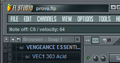

#### 1. Metodo impiegato nell’analisi (20 pagine)
##### 1.1. Metodo impiegato nell'analisi
##### 1.2. Regola del 7
##### 1.3. Confronto di approccio tra vedente e non vedente 

#### 2. Descrivere problemi di usabilità dal punto di vista dell’utente
##### 2.1. Come renderli accessibili
<--!COMPLETARE>
##### 2.2. SDK per l'accessibilità
<--!COMPLETARE>

#### 3. Ipotesi su problemi e errori nella programmazione a livello software
<--!COMPLETARE>
##### 3.1. Limiti delle applicazioni multipiattaforma

Prima di addentrarsi nei limiti delle applicazioni multipiattaforma è necessario  comprendere il significato attribuito dall'industria informatica al termine *"Piattaforma"*, con piattaforma intendiamo l'insieme della configurazione di un personal computer che include, sia il tipo di architettura hardware del microprocessore, che l'insieme dell'hardware dell'intera macchina, sia il sistema operativo su cui le applicazioni vengono eseguite [^piattaforma].
Negli anni il mercato dei personal computer ha subito vari sconvolgimenti, rimanendo per molto tempo  frammentato in una miriade di architetture e configurazioni hardware differenti, in un mondo dove le prestazioni dei personal computer rimanevano ancora estremamente limitate. Le case software che sviluppavano software multipiattaforma erano costrette a sviluppare una versione ad hoc delle loro applicazioni per ogni CPU[^cpu] supportata. Più avanti, nei tardi anni '90, il mercato del PC si stabilizzò e le architetture commerciali rimasero Power PC[^power-pc] con MacOs e Intel x86[^intel-x86] con Windows. In questo contesto evolutivo  è importante considerare che l'aumento di complessità delle applicazioni è stato accompagnato dall'aumento esponenziale delle prestazioni hardware; contemporaneamente i sistemi operativi offrivano agli sviluppatori set di API[^api] sempre più ad alto livello per facilitare l'integrazione sul numero più ampio di configurazioni hardware differenti a parità di architettura hardware\software. Questo livello di astrazione aiutò gli sviluppatori a concentrarsi sullo sviluppo delle applicazioni diminuendo il tempo necessario all'integrazione e all'adattamento. Sempre seguendo questa filosofia si sono diffusi linguaggi di programmazione via, via più indipendenti dall'architettura hardware/software come il JAVA[^java]. Questi tipi di tecnologie aggiungono un livello di complessità che non permette all'applicazione di sfruttare appieno la potenza computazionale della macchina, in molti ambiti la differenza in prestazioni con una applicazione nativa può essere di 1:100 o di 1:1000. Per questo motivo negli anni le case software hanno sviluppato dei framework (SDK[^sdk]) che permetessero lo sviluppo di applicazioni in modo semi agnostico (indipendente) dal sistema operativo utilizzando linguaggi nativi come il C o il C++. Questa categoria di framework comprende, tra le altre, le QT library (Nokia)[^qt] per lo sviluppo multipiattaforma della GUI[^gui] dei programmi. Questo tipo framework ha una versione dedicata su ogni piattaforma (ad esempio Windows, Mac, embedded[^embedded][^embedded-qt]) la quale cerca di compensare le differenze di implementazione per ogni sistema operativo supportato riducendo drasticamente i tempi di adattamento a livello di sviluppo. In un articolo del blog *"The Accessible Music Notation"* riportiamo letteralmente un commento relativo alla vecchia versione del famoso software *MusicScore*[^music-score] che utilizzava le librerie Qt:

> "\[...\] the Qt framework used by MuseScore has a number of issues that make it difficult to produce fully accessible applications of any complexity."[^music-score]

[^api]: API è un acronimo che sta per *"Application Programming Interface"* traducibile in italiano con *"Interfaccia per Programmazione Applicativa"*
[^piattaforma]: Nel paragrafo si fa riferimento alla definizione di Piattaforma data da *"The Linux Information Project"* disponibile a questo link *"http://www.linfo.org/platform.html"* consultato in data 20/01/2019
[^cpu]: CPU è un acronimo che sta per *"Central Processing Unit"* in italiano *"Unità di elaborazione centrale"*
[^power-pc]: Architettura di microprocessori commercializzata a partire dal 1991 da *Apple* in collaborazione con *IBM*, tratto dal libro di *Carlton Jim* intitolato *"the inside story of intrigue, egomania, and business blunders"* pubblicato a New York da *"Times Business/Random House"* nel 1997 capitolo *"The march to PowerPC"*.
[^intel-x86]: È una famiglia di microprocessori commercializzata dalla *Intel* a partire dal 1978, tratto dal libro *"Intel Microprocessors: 8008 to 8086"* scritto dal progettista di chip *Stephen Paul Morse*, libro scaricato il 22 Gennaio 2019 a questo link: *http://stevemorse.org/8086history/8086history.doc*
[^java]: Java è un famoso linguaggio di programmazione creato nel 1995 da *James Gosling* allora ingegnere alla *Sun Microsystems*
[^sdk]: SDK è un acronimo che sta per *"Software Development Kit"* in italiano *"Kit di sviluppo Software"* fonte *"IT Glossary"* della azienda *Gartner* consultato il 22 Gennaio 2019 a questo link: *https://www.gartner.com/it-glossary/sdk-software-development-kit* 
[^gui]: GUI è un acronimo che sta per *"Graphic User Interface"* in italiano *"Interfaccia Grafica"*
[^qt]: Sito ufficiale delle Qt: *https://www.qt.io/*
[^music-score]: Articolo consultato il 22 Gennaio 2019 al seguente link: *https://accessiblemusicnotation.wordpress.com/2014/08/27/musescore-2-0-beta-1-released-with-accessible-score-reading-support/*
[^embedded]: Con Sistema Embedded si intendono tutti quei sistemi informatici ad alto livello di integrazione come spiegato da *Tech Target*, articolo consultato il 22 Gennaio 2019 a questo link: *https://internetofthingsagenda.techtarget.com/definition/embedded-system* 
[^embedded-qt]: Qr library ha una versione dedicata a Linux Embedded, link della documentazione: *http://doc.qt.io/qt-5/embedded-linux.html*

Il principale punto di debolezza dei framework multipiattaforma riguarda l'integrazione con le feature particolari di ogni sistema, con questo si può pensare sia all'integrazione con i componenti software del sistema operativo, sia con l'hardware specializzato del sistema; 
Questo limite tecnico è un compromesso ammissibile per la maggior parte delle applicazioni. Un esempio lampante di questa filosofia riguarda il web. Una pagina web ha una scarsa integrazione con il sistema, questo compromesso permette allo stesso codice di poter offrire le stesse funzionalità attraverso dispositivi con architetture hardware, sistemi operativi, tipologia di display, completamente differenti tra loro.

Ciò, in termini di accessibilità, comporta che ogni implementazione dei browser si integri in maniera differente con ogni  sistema operativo.
Inoltre ogni browser potrebbe interpretare a suo modo i tag di accessibilità andando ad aggiungere un ulteriore **strato di indirezione** tra le scelte dello sviluppatore e gli effetti sull'esperienza utente.
A peggiorare ulteriormente il fattore di accessibilità ci sono le cosiddette tecnologie assistive, Ad esempio ogni sintesi vocale implementa un'euristica <!-- reference definizione --> differente per il raggruppamento e la rilevazione delle gerarchie tra i componenti. In questo sistema quindi le applicazioni che riescono ad essere più accessibili sono quelle che riescono ad eliminare quanti più **strati di indirezione**, da una parte nei confronti del sistema operativo quindi anche dell'architettura hardware; dall'altra con le funzionalità di accessibilità specifiche dell'ambito d'uso. Questo quindi include gli eventuali software e configurazioni specifiche nel contesto utente. Tutti questi elementi indicano che il modo migliore per garantire l'integrazione dell'applicazione sia quella di lavorare integrando direttamente la propria applicazione con gli SDK messi a disposizione dalle case software dei vari sistemi operativi. Laddove sia necessario sviluppare in modo indipendente dalla piattaforma, la strategia migliore risulta nel verificare a priori che ogni tecnica o schema di sviluppo, si vada ad adattare in modo accettabile su ogni piattaforma. Verifiche di questo tipo sono, per la maggior parte, facilmente automatizzabili: un esempio lampante di questo approccio si può  trovare all'interno di Google Play[^google-play]. Qui, ogni volta che lo sviluppatore aggiunge una versione dell'app sullo store, in cloud in automatico, vengono verificati i requisiti di accessibilità su ogni singola schermata[^play-access], pur non essendo un contesto multipiattaforma i vari framework, come Qt, sarebbero facilmente adattabili ad un approccio simile utilizzando determinate feature messe a disposizione per il colllaudo del software.
Di norma le applicazioni maggiormente accessibili sono quelle sviluppate ad hoc per un certo sistema operativo, ad esempio su Windows il browser più accessibile e fruibile è Windows Edge se utilizzato con la sintesi Windows Narrator, anche da touch screen; su piattaforma Mac si può dare lo stesso giudizio in merito al browser Safari utilizzato con VoiceOver.

[^google-play]: Il famoso negozio di contenuti online di *Google* reperibile  a questo link: *https://play.google.com/store*
[^play-access]: Sezione *"Accessibilità"* dell'articolo sui *"Rapporti pre-lancio"* di play console, consultato il 22 Gennaio 2019: *https://support.google.com/googleplay/android-developer/answer/7002270?hl=it*

Analizzando poi nel concreto le varie configurazioni utente è facile dedurre che piattaforme come Mac Os sono avvantaggiate dal punto di vista dell'integrazione, la Apple gestisce direttamente l'intera filiera dei propri prodotti, partendo dall'hardware fino al sistema operativo e le applicazioni, quindi riducendo moltissimo i **livelli di indirezione** tra le scelte degli sviluppatori e l'esperienza utente. Un ulteriore punto a favore dei prodotti Apple, da questo punto di vista, si ha considerando che per Mac l'unica sintesi vocale disponibile è VoiceOver, che viene direttamente sviluppato come progetto interno ed ha  notevoli vantaggi nei confronti di Windows Narrator poiché gestisce nativamente supporti come i Display Braille.

##### 3.2. Progettazione dell'User Expirience

Lo sviluppo di applicazioni include varie fasi e tipologie di progettazione. Iniziando dalla mera analisi delle specifiche, alla scelta delle tecnologie e delle librerie da usare, all'architettura software più adatta al tipo di applicazione che si intende sviluppare. Però la fase più importante per chi fruisce dell'applicazione è la progettazione dell'esperienza utente, per questo motivo l'esperienza utente (UX) è uno degli aspetti più complessi della progettazione software. Relativamente all'esperienza utente è facile incorrere in errore pensando esclusivamente all'aspetto grafico, l'user experience però va oltre i canoni della GUI e include tutti gli aspetti di interazione che si verificano tra l'utente e l'applicativo, servizio o prodotto. Si pensi ad esempio all'interazione che si verifica con un assistente vocale come Amazon Alexa, il tipo di comandi e il modo in cui vengono gestite le richieste. Tutto questo fa parte comunque dell'esperienza utente, anche il tono o il sesso della voce diventano fattori estremamente rilevanti. 

Detto ciò è facile intuire che lo studio di una buona esperienza utente parta in primo luogo dall'individuazione delle superfici di contatto tra l'utente e l'applicativo, in questa maniera sarà facile evitare la maggior parte dei problemi di usabilità.  
L'esperienza utente in termini di usabilità si delinea andando identificare i requisiti minimi di accesso, questo  approccio permette di circoscrivere i casi d'uso a cui l'applicazione deve rispondere. Il livello più basilare di analisi riguarda il contesto di utilizzo, si pensi ad una applicazione che implementa la lista della spesa, è facile capire che il caso d'uso tipico si svolgerà nella corsia di un supermercato, dove l'utente probabilmente non avrà a disposizione entrambe le mani, quindi in un caso simile lo sviluppatore dovrà evitare di rendere obbligatorie operazioni come il doppio tocco o il pinch, perché banalmente  sono interazioni che richiedono l'uso di entrambe le mani. Per far fronte a queste problematiche, potrebbe essere utile l'integrazione con un assistente vocale come Google o Siri, oppure l'aggiunta di una notifica permanente[^notifica-permanente] o di un widget[^widget-ios] per l'accesso rapido dal blocco schermo. Come si vede da questo esempio, da un osservazione banale è possibile, utilizzando un approccio bottom-up[^bottom-up], risalire alle esigenze a cui l'applicazione dovrà rispondere. Altri casi di analisi, invece, potrebbero non avere soluzione con le tecnologie attuali, si pensi ad esempio alla realtà virtuale, nel caso in cui l'utente sia costretto in una posizione, senza avere la possibilità di ruotarsi su se stesso o abbia limitazioni di rotazione della testa, sarà facilmente possibile aggiungere dei controlli addizionali all'applicazione per permettere la navigazione dell'ambiente virtuale senza dover interagire con l'accelerometro o la bussola. Per contro, lo stesso esempio riportato alla disabilità visiva, non risulta risolvibile, a meno che non venga sviluppata un'esperienza dedicata attraverso l'utilizzo di feedback uditivi. Sempre su questa linea altre limitazioni si possono riscontrare quando si ha una sommatoria di limitazioni, si pensi nuovamente alla realtà virtuale, e in particolare ad una realtà virtuale basata sugli stimoli sonori, come precedentemente teorizzato , probabilmente questo tipo di esperienza si baserà sull'ascolto bi-canale, nel caso in cui l'utente abbia anche un deficit da una delle due orecchie, potrebbe compromettere definitivamente l'usabilità dell'applicazione.
Si può concludere che ad ogni tipo di limitazione si può trovare un insieme di soluzioni applicabili. Nei sistemi operativi mobile di nuova generazione, ad esempio, il fattore di accessibilità è seriamente considerato: dalle case produttrici vengono messi a disposizione, sia degli sviluppatori che degli utenti, set di strumenti per colmare ogni tipo di scompenso. 

[^notifica-permanente]: Nel sistema Android le applicazioni hanno la possibilità di creare delle notifiche persistenti, selezionando la modalità *"ongoing"* come spiegato a questo link: *https://developer.android.com/reference/android/app/Notification.Builder#setOngoing%28boolean%29*
[^widget]: Nel sistema iOS i *widget* sono delle *"micro applicazioni"* fruibili dal blocca schermo, come spiegato a questo link: *https://support.apple.com/it-it/HT207122*
[^bottom-up]: Con *"bottom-up" si intende *\<\<starting with details rather than a general idea\>\>* in italiano *"Partendo dai dettagli invece che dall'idea generale"* tratto da  *Macmillan Dictionary* consultato il 22 Gennaio 2019 a questo link: *https://www.macmillandictionary.com/dictionary/british/bottom-up*

##### 3.3. Integrazione di controller esterni e display braille

I software di produzione audio utilizzano il MIDI come protocollo per la gestione dei controller esterni. Spesso l'interazione con i controller emula l'interazione coi controlli presenti nella GUI all'interno dell'applicazione, ad esempio è possibile gestire i singoli canali del mixer digitale utilizzando un controller come il *nanoKontrol 2* della *Korg*[^nanoKontrol]. Tale interazione si basa frequentemente su alcuni feedback visivi all'interno della UI del software; altre volte invece modifica lo stato dei led sul controller. Tale interazione è esclusivamente unidirezionale per la maggior parte dei controlli fisici: cambiando il valore di una manopola pilotata dal controller all'interno dell'UI del programma gli effetti non si presenteranno sul controller. Altre categorie di controller supportano le modifiche sia dal software verso il controller, sia dal controller verso il software, quindi ad esempio cambiando il valore del master nel mixer digitale il valore si aggiornerà anche sul mixer MIDI[^mixer-youtube].

[^mixer-youtube]: Esempio su Youtube *https://www.youtube.com/watch?v=fGdWNUQvaYw*
[^nanoKontrol]: Mixer midi prodotto dalla Korg, link consultato il 22 Gennaio 2019: *https://www.korg.com/it/products/computergear/nanokontrol2/*

L'integrazione con i controlli esterni nelle DAW non è standardizzata ed essendo il MIDI un protocollo aperto i vari controller supportano una grande varietà di configurazioni e supporti diversi tra loro, ad esempio le periferiche MIDI possono implementare controlli come bottoni, sliders, potenziometri, interruttori, sul controller possono identificare la velocity della pressione, oppure emulare l'after touch del pianoforte convertendo tutti i parametri fisici in digitale. Essi hanno un set di input\output differenti per cui l'integrazione all'interno del software può diventare caotica. Molti produttori di controller MIDI stipulano accordi commerciali per avere il supporto ufficale da parte degli sviluppatori delle DAW. Alcune DAW includono tool di personalizzazione dell'integrazione che permettono di importare direttamente i file di configurazione ufficiali del produttore del controller o di costruirne uno custom. Per quanto riguarda l'accessibilità le interfacce MIDI peccano a livello di feedback dei comandi. L'utente nella maggior parte dei casi, in mancanza di un contatto visivo con il controllo pilotato dal controller su schermo, è costretto a verificarne manualmente il valore all'interno dell'interfaccia del software. Questo problema sussiste anche nel caso in cui il controllo non sia visibile a schermo nel momento della modifica. Molte DAW, per sopperire a questa casistica di problemi, hanno aggiunto nella barra di stato una didascalia che indica l'input MIDI attuale. Quindi, nel momento in cui viene inviato un comando MIDI alla DAW, viene immediatamente visualizzato nella barra di stato. Un esempio di software che utilizza questo approccio è *Fruit Loops*[^fruit-loops], esempio in figura. Oltre ai controller MIDI, un esempio di periferica importante per l'usabilità del software è il display braille[^capitolo-2.6].

[^capitolo-2.6]: Riferimento a *Capitolo 2.6*
[^fruit-loops]: *FL Studio* anche detto *Fruit Loops* è un software della *Image Line Software*, riporto il sito web ufficiale consultato il 22 Gennaio 2019: *https://www.image-line.com/flstudio/*

<!-- Da testare integrazione e korg -->
Si è scelto di accostare all'interno della stessa sezione i display braille e i controller MIDI,  in quanto sono supporti indispensabili per raggiungere parametri altrimenti non accessibili come ad esempio la regolazione del Panning, dei volumi delle tracce, l'attivazione delle funzionalità presenti nei mixer virtuali. 

##### 3.4. Feature accessibilità Windows

##### 3.5. Feature accessibilità MacOS
##### 3.5. Logic Pro come modello

#### 4. Analisi accessibilità DAW
##### 4.1. Analisi di Reaper (Windows\MAC)
##### 4.2. Analisi di Cubase (Windows\MAC)
##### 4.3. Analisi di Pro-Tools (Windows\MAC)

#### 5. Interviste Opzionali
