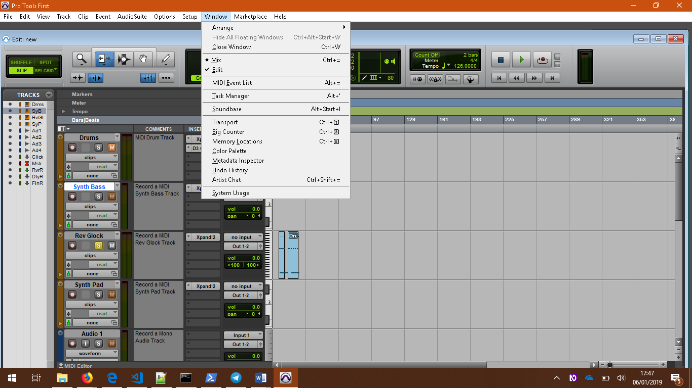
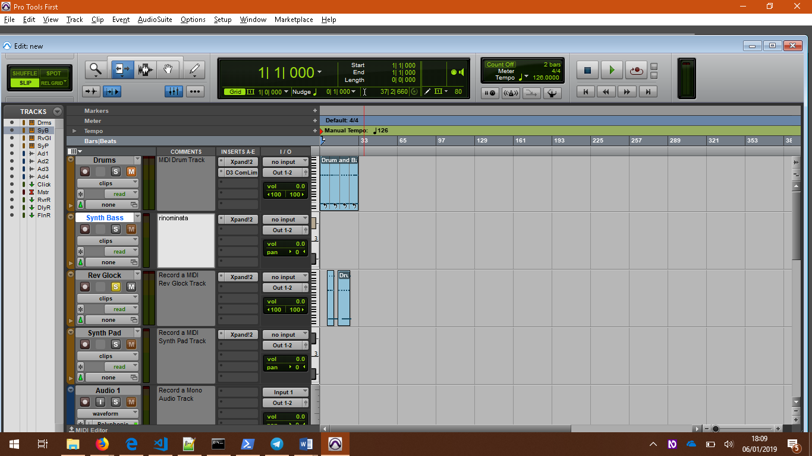
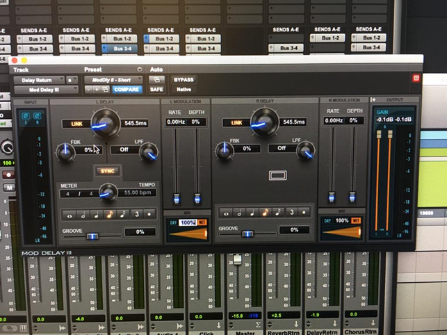
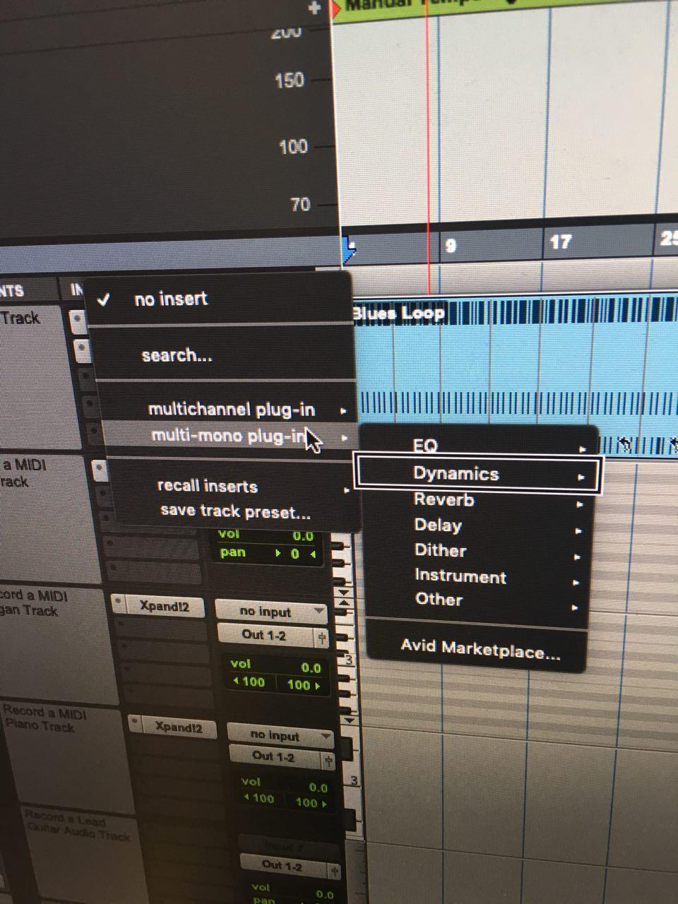

## Analisi di accessibilità dei programmi
### Presupposti
In questo lavoro si analizzano Reaper della softwarehouse Cockos; Pro Tools dell’Avid e Cubase della Steimberg. I test relativi ai programmi sono eseguiti usando Windows 10 versione 1803 (build SO 17134.472) e Mac Mojave 10.14. Ne consegue che tutte le procedure esposte in questa sezione fanno riferimento a queste versioni, se non diversamente indicato.

### Windows vs Mac perché la scelta di provarli su diversi sistemi operativi
In una prima fase ci si era preposti dilimitare l'analisi esclusivamente al sistema operativo Windows, successivamente si è preferito testare i programmi su entrambe le piattaforme, per fornire un quadro più completo dell'offerta commerciale e cercare di evidenziare le differenze nell’esperienza dell’utente nell’uso, nelle modalità di ricevere i feedback, nell’ubicazione dei pulsanti nella GUI o nei menù.
Si è scelto di utilizzare una scala di valori da 0 a 4 per indicare con 4 il massimo grado di usabilità e rapidità di accesso alla funzionalità, 0 completamente inutilizzabile.
Livelli di accessibilità:
- livello 0: comando totalmente irraggiungibile dai comandi da tastiera, inoltre la sintesi vocale non riconosce la presenza del controllo in caso di interazione col mouse (nessuna interazione)
- livello 1: il comando è raggiungibile da tastiera utilizzando il cursore o tramite shortcut, solamente in un determinato contesto non facilmente discriminabile utilizzando la sintesi vocale, però la sintesi vocale non dà feedback dell'attivazione del comando e non è possibile tramite sintesi vocale rendersi conto degli effetti.
- livello 2: il comando è raggiungibile da tastiera utilizzando il cursore o tramite shortcut, la sintesi vocale non dà feedback ma è possibile verificare l'efficacia del comando
- livello 3: il comando è raggiungibile da tastiera utilizzando il cursore o tramite shortcut, la sintesi vocale dà feedback ed è possibile verificare l'efficacia del comando
- livello 4: il comando è totalmente accessibile da tastiera, è perfettamente integrato all'interno del contesto grafico e rende i riferimenti riguardo l'intera situazione del contesto.
	

### Perché testare con NVDA
Si è scelto di usare la sintesi vocale NVDA (NonVisual Desktop Access) perché è facilmente reperibile, è gratuita, subisce spesso aggiornamenti (circa ogni 3 mesi) che la mantengono al passo con le novità tecnologiche.
è risultata molto efficace nella fase di testing dei programmi in quanto  ha consentito una facile esplorazione dello schermo sfruttando il mouse come principale strumento di esplorazione. In pratica muovendo il mouse, gli elementi che man mano si trovano sotto il puntatore, vengono letti e la sintesi non intralcia le comuni operazioni di clicc con entrambi i tasti, o di scrool con l’apposita rotella. 
Il difetto è che di tanto in tanto rallenta la reattività di esecuzione delle operazioni o si riavvia in automatico (ossia senza specifico intervento dell’utente)

### Installazione dei programmi


#### Riferimenti
<!-- 
    CITARE A PIE ‘DI PAGINA sito casa produttrice dove sono indicate versioni programmi e versioni sistemi operativi compatibili. E dove è possibile scaricare il software. 
    https://www.reaper.fm/download.php 
-->

### Plug in
All’utente non vedente non è sufficiente solamente installare il programma ma, sia in Windows che in Mac, è obbligato a installare i plug in di accessibilità  che sono  in grado di risolvere la gran parte dei problemi, ma non la totalità.

[Download SWS Extension](http://www.sws-extension.org/)
[Cockos Inc] (https://www.cockos.com/index.php)


### Metodo di analisi
Per l’analisi si è proceduto manualmente testando ogni singolo pulsante, ogni singola feature; basandosi sul confronto delle indicazioni riportate nella guida [^https://osara.reaperaccessibility.com/]; la community di sviluppatori [^https://github.com/jcsteh/osara] e dalla documentazione riportata sul sito dell’azienda produttrice di Reaper Cockos inc; la quale talvolta risulta inaccessibile al non vedente. Vi sono poi tanti materiali in YouTube, ma purtroppo solo rivolti ai normodotati in quanto indicano solo procedure via mouse basandosi su spiegazioni che prevedono esclusivamente l'uso della vista. Nonostante ciò si è potuto ricorrere al canale di Garth Humphreys [^https://www.youtube.com/channel/UC-rL46RtrPdb_I3awd9eJow];
che è stato un fondamentale apporto non solo per quanto riguarda il sistema operativo Mac, ma anche per Windows in quanto, provando, ho riscontrato la presenza di shortcut similari, ossia una corrispondenza tra la mappatura della keystroke nei due sistemi. Ad esempio quando in Windows la shortcut richiede il tasto Start, in Mac richiede Mac+Control; quando in Windows si usa Control in Mac si usa CMD; quando in Windows si usa Alt in Mac si usa Option; mentre Shift è uguale in entrambi.
Si ricorda che alcune operazioni hanno effetti diversi secondo il contesto in cui vengono eseguite e quindi dal posizionamento del focus. Ciò significa che la medesima shortcut, se eseguita in un dato contesto, ha un effetto, che varia, se il focus è spostato altrove.

Durante la fase iniziale si è provveduto a fare uno studio generico sulla GUI (Graphical User Interface), per avere un’idea spaziale sul collocamento degli elementi, usando il mouse.
Successivamente si è provveduto a esplorarla nuovamente usando i tasti di navigazione da tastiera: in ambiente Windows usando il tasto TAB (per navigare tra i controlli) e, in particolari tipologie di finestre il tasto F6 per passare da un riquadro a un altro (dalla tree view all’elenco degli items).

Nella terza fase si è svolto uno studio sulle guide d’uso, avvalendosi, come già precisato, di più fonti in quanto nelle linee guida all’uso di questi software non è stata posta sufficiente attenzione al non vedente, cosa che è stata riscontrata anche nelle risorse video. Ad esempio in YouTube si trovano decine di video che spiegano comandi in cui fondono imput da tastiera sommati a imput del mouse e troppo pochi specifici per i non vedenti.
Sarebbe auspicabile trovare modalità di esecuzione dei comandi che vadano incontro alle esigenze di tutti.

Inoltre quelle poche risorse esistenti, rivolte specificatamente ai non vedenti, non tengono conto delle esigenze degli ipovedenti o degli ipovedenti gravi, in quanto danno un riferimento solo uditivo con la voce fuori campo, senza tener conto di un riscontro visivo [^https://www.youtube.com/channel/UC-rL46RtrPdb_I3awd9eJow].

sarebbe opportuno, oltre al pregevole, dettagliato commento vocale, aggiungere a video l’esecuzione  in tempo reale dei comandi impiegando tutto lo schermo, o anche solo metà per lasciare spazio all’immagine del parlante. Ai fini di facilitare ulteriormente gli ipovedenti l’ideale sarebbe la prima ipotesi. 
Nella porzione di schermo dedicata alle procedure è importante non tralasciare l’evidenziare in tempo reale gli elementi e i controlli di volta in volta usati con riquadri dai bordi spessi e con colori contrastanti rispetto allo sfondo. 
Un esempio virtuoso è il canale di Valter Scarfia [] che, nello spiegare funzionalità in merito all’Iphone, applica quanto appena affermato.

In Reaper per Windows sono state provate tutte le possibilità per raggiungere uno stesso risultato: la via estesa sfruttando i menù e la via rapida coi comandi da tastiera o sfruttando i buttons, ad esempio i controlli posti sulla singola traccia o sulla master track.


Dall’esplorazione della GUI si sono subito “trovati” i buttons relativi alle tracce, come i controlli solo, mute, record, stop, pausa, record mode, pan feader, envelopes and automation effects I/O, dai quali poi si è risalito a trovare le relative shortcut.
sempre rimanendo nell’ambito della traccia è possibile rinominarla. Si noti che, alla creazione di una nuova traccia il focus è di default posizionato all’interno del campo editazione e si completa l’operazione dando invio, o in alternativa, esc.

Tali controlli non sono totalmente accessibili in quanto non viene annunciato che si tratta di un pulsante e l’azione che nvi si può eseguire come ad esempio scorrimento, clic, ma viene annunciato solo il nome del controllo.
Si è passato a analizzare la finestra “project settings” dove si può regolare i parametri generali, relativi all’intero progetto come la frequenza di campionamento, i BPM, impostare il metro del brano, i parametri contenuti in questa finestra sono accessibili nella loro  totalità in quanto vengono enunciate, per ogni controllo, il tipo di controllo, la possibilità di editare nel campo, il valore di default e il valore modificato dall’utente.
Per maggiore chiarezza si riportano le definizioni relative a frequenza di campionamento, BPM e metro, basandomi sulla mia esperienza personale di musicista e sugli studi accadeici svolti.
La frequenza di campionamento il numero di volte al secondo in cui i dati, i campioni, vengono registrati e memorizzati (lo standard impiegato per i CD è 44.100 Hz al secondo). I BPM (Beat Per Second) il numero di beat al minuto impiegati in musica per dare l'indicazione relativa alla velocità del metronomo. Il metro ossia la ricorsività degli accenti (le battute).  


Dal navigare, tramite TAB i pulsanti presenti sulle tracce, sempre col medesimo tasto, ci si può spostare nella timeline e da lì navigare spostandosi a inizio o fine traccia, spostando il cursore per battute, per percentuale , per millisecondi per beat, o facendo lo scrubbing )ossia una curva d’onda alla volta), inoltre ni comuni 

Tutto questo è altamente accessibile, sono poche le DAW che permettono di eseguire lo scrubbing, che consente  anche a un non vedente di raffinare ad alto livello il proprio progetto.
Simili comandi e s imili possibilirtà di navigazione sono valide anche per la selezione. Vi sono poi ulteriori comandi con i quali si può scelgiere se la selezione coinvolge sia timeline che items oppure solo questi ultimi.
Dopo la selezione è naturalmente possibile svolgere svariate operazioni come la rimozione, il tagliare, copiare del tratto di brano selezionato, o il duplicare l’intera traccia.
Una volta selezionata una porzione è possibile riprodurla in loop portando il cursore (anche detto edit cursor o play cursor) all’inizio della stessa e cliccando "Play". 
Quando una porzione viene rimossa, se non si dà uno specifico comando oppure se si è impostato il “ripple off”, viene lasciato del silenzio. Per evitare ciò, e unire quindi “i due lembi” si può attivare il “ripple on” e riferirlo alla singola traccia "per track", oppure a tutte le tracce del progetto "alll traks", usando la combinazione di tasti Alt+P  per modificare lo stato del Ripple.
Se il comando attivo è "ripple on" quando si elimina un item, l'item immediatamente successivo prende il posto di quello appena cancellato e i due rimanenti risultano accostati; questo consente di non avere silenzi tra il materiale sonoro.
A titolo esemplificativo si associa agli items le lettere A, B, C.
Se si intende eliminare l'item B, A e C si uniscono e quindi la traccia avrà un flusso continuo, cosa che non accade se si è attivata la funzione "Ripple off", cui si è precedentemente accennato.  
Lo stato del "Ripple on", e "Ripple off", si modifica, come già accennato, con la combinazione di tasti Alt+P in Windows, Cmd+P in Mac; mentre per avere una notifica sullo stato attuale del "Ripple", si impiega la combinazione Alt+Shift+P. 
Alcune DAW prevedono che l'operazione di unione venga svolta manualmente tramite il drugging del mouse scorrendo sulla griglia.


Di vitale importanza per il non vedente è l’impiego dei marker (o marcatori), che in Reaper si dividono in 3 categorie: marker di progetto, temporali, di stretch.  Alcuni tipi sono ad esempio i marker comuni, cui  associata la shortcut "M", marker prompt for name Shift+M, "Region from time selection" Shift+R, "Tempo/time signature marker". Sono esempi di varie tipologie di marker, appartenenti alle 3 categorie presenti in Reaperconsentono di selezionare regioni caratterizzate da un altro metro o una velocità diversa (marker di tempo), opppure di assegnare nomi indicativi a porzioni della traccia (marker cui è possibile dare un nome personalizzato).
I marcatori consentono di segnare sulla traccia dei punti di interesse, navigabili con Control+Frecce, che consentono di spostare l’edit cursor con velocità da una sezione all’altra del brano.
Una funzione simile a quella dei marcatori, è svolta dagli "items", sempre richiamabili dal menù "Insert" o con la combinazione di tasti Shift+Insert+N, nello specifico sitratta dei "New MIDI items".
Markers e items sono due diversi strumenti per raggiungere risultati identici. I marker consentono solitamente di agire su più traccce, mentre gli items sono orientati all'editing della singola traccia. è però possibile ad esempio raggruppare gli items di più tracce, di modo che l'operazione eseguita le coinvolga tutte. 
Nel caso in cui si voglia rimuovere una battuta da 3 tracce si può scegliere o di creare, tra marcatore d'inizio e di fine, una timeselection, oppure impiegare gli items impostando il Ripple su "all traks". 
Per chi non vede sono utili anche perché, delimitando con un “marker di apertura” e un “marker di chiusura”, anche detti envelopes, una porzione, è possibile selezionarla e modificarne il tempo, il volume, la dinamica.
Una funzione utile in questo senso è il poter creare marker con nome personalizzato. Questo è possibile usando il menù "Insert" o, in alternativa, la combinazione di tasti Shift+M che apre una Windows in cui editare nome e valore, permettendo di scriverlo mediante tastiera. Ciò non obbliga l'utente a regolare il valore tramite lo slider. Quest'ultima modalità, a mio avviso, non è molto pratica in quanto sovente accade che il cursore si sposti di un punto percentuale alla volta (rendendo l’operazione molto dispendiosa in termini di tempo); oppure che lo slider si sposti di una quantità percentuale predefinita dagli sviluppatori del programma (ad esempio 3% 5% 10%), il che rende impossibile all’utente raffinare il suo inserimento. Frequentemente sono presenti entrambi, ma non è il caso di Reaper.


Un’altra funzionalità di base, importante per la registrazione, è l’impostazione del metronomo e la sua attivazione, cosa che ancora una volta è facile da eseguire, semrpe tramite tastiera o usando l’apposito menù in esso si può impostare se il metronomo  inizia prima della registrazione e di quanti beat; impostare il beat patner; impostare il patner primario e secondario ecc operazioni con un elevato grado di accessibilità in quando viene annunciato dalla sintesi se i flag sono selezionati o meno, se la combobox, ad esempio del beat patner, è collassata o espansa, nei campi editazione ad esempio del primary beat o del secondary beat viene annunciato che vi si può editare del testo e anche in questo caso viene annuncaito il valore di default e, dopo l’9intervento dell’utente, il nuovo valore immesso. 


Si può selezionare il tipo di traccia, ad esempio audio, midi, audio mono, audio stereo, audio mono  traccia tempo, traccia da fonti esterne, dal menù tracks o dal menu’ applicazioni relativo alla traccia apribile selezionando la traccia e premendo il tasto applicazioni.

Il comando Capslock+I permette di eseguire alcune operazioni altrimenti complicate da eseguire dal mix, come  pan, track channel, volume fader digitando i valori nei fields.
per importare una traccia è disponibile il comando da tastiera Insert che richiama subito la finestra da cui avere accesso alle directory del sistema operativo e prelevare i file precedentemente salvati.
Le sample delle ttracce, dato che sono collocate in dei menu’ standard, sono accessibili al massimo grado e non si sono riscontrati problemi comeil posizionamento scorretto del focus os imil.ù
Le operazioni che di solito vengono svolte a progetto terminato, come l’esportazione della traccia, Il salvataggio e render del progetto eccsono opzioni situate nel menu’ file, raggiungibili con le frecce.
il salvataggio può esser del singolo progetto con  Control+S; di tutti i progetti )cui non è associata alcuna shortcut) salva come Alt+S, può esserne chiuso solo uno con Control+F4 o tutti Control+Shift+F4, è stata posta attenzione alla difficoltà mnemonica causata dalle shortcut perciò in questi casi sono state associate shortcut standard, comuni nella gran parte dei programmi, mentre, laddove possibile, n è stato usato  il criterio che richiama la prima lettera del nome del comando. 

I comandi Salva, Salva come o Salva tutti i progetti aprono una finestra standard di Windows perciò non si ritiene utile soffermarvisi eoo.
2019
Il comando Render si richiama con Control+Alt+R e consente di  sommare tra loro le singole tracce selezionate ed esportare il tutto in un unico file.
il concetto di render varia leggermente secondo la DAW che si sta impiegando. Questo appena esposto è quello relativo a Reaper.
il processo di rendering è la parte definitiva di composit dell'IDE (Integrated Development Envirement).

La mastertrack è la traccia che consente di gestire i parametri sull’intero progetto, ad esempio se si modifica il volume o il tipo di riverbero, ne risentiranno a cascata tuttel e altre tracce; la mastertrack si rende visibile con Control+Alt+M e, premendo nuovamente la combinazione la si nasconde.
Il mixer è piuttosto accessibile sfruttando il tracciamento del mouse, ma non tutti gli elementi vengono letti, mentre i comandi da tastiera non sono fruibili, però non è così fondamentale in quanto l’alternativa è sfruttare i controlli presenti sule tracce; da questo punto di vista i programmi su piattaforma Mac sono più user friendly in quanto i mixer sono ampiamente utilizzabili anche da di non vedenti.

Inserire gli effetti è possibile in due modi: o dal pulsante presente nel mixer o dal pulsante sulla master track o sulle singole tracce. Il modo più rapido e più accessibile è premendo il tasto F, in quanto raggiungere i pulsanti implica lo scorrere con le frecce col Tab, procedura che è molto dispendiosa in termini di tempo. Una volta aperto il pannello degli effetti viene letto interamente, c’è una sezione inaccessibile che sono le librerie Cntact, che richiedono opportuni plug in (sviluppati da Andrea De Solis che dà a pagamento).

### ```Impostazioni griglia (grid) FACOLTATIVO```
Impostazioni dei canali di ingresso e di uscita, spiegare che in cubase devi fare tuto manualmente mentre in Reaper è tutto automatizzato.

#### Reaper versione 5.95 per Windows installazione
Il programma è progettato sia per il sistema operativo Windows che per Mac
In Windows l’installazione di Reaper è molto accessibile in quanto segue le procedure standard: la totalità dei contenuti delle varie finestre sono  raggiungibili usando i tasti TAB e le frecce, la sintesi vocale suggerisce anche le shortcut associate ai pulsanti.
Aspetto a suo favore è la facilità di gestione della pagina web da cui scaricare il programma, priva di pop-up pubblicitari e di immagini che rendono più complessa la navigazione. Il software è scaricabile al seguente link [https://osara.reaperaccessibility.com/snapshots/.](https://osara.reaperaccessibility.com/snapshots/.)

####Reaper per Mac OS X versione 5.921 installazione
  [^ Tratto da https://reaperaccessibility.com/index.php/Chapter_1:_Setting_Up_and_Getting_Started#1.2_Installing_REAPER_on_an_OS_X_Mac       Consultato 2 gennaio 2019)]
Per installare Reaper sul sistema operativo Mac è necessario aprire REAPER disk image (.dmg), per aprire questo file è necessario accettare le condizioni di  licenza del programma cliccando su "aconsento".
Infine  trascinare l'icona di Reaper all'interno della cartella applicazioni.
Il programma è scaricabile, sia per Windows, che per Mac, al seguente link ufficiale della softwarehouse:
[^https://www.reaper.fm/download.php]


#### Reaper 5.921 per Mac
Per quanto riguarda le procedure impiegate,si è operato come descritto sopra.

Dapprima provando a raggiungere tutti i menù (sia quelli della barra superiore coi relativi sottomenù, sia i menù contestuali), i controlli, (ad esempio quelli sulle tracce, menù contestuali aperti dai controlli stessi). Si è tentato inoltre di navigare all’interno delle finestre, che nel complesso sono più accessibili che in Windows.

I controlli presenti sulle tracce e i loro relativi tasti rapidi associati sono identici a quelli presenti in Windows: ad esempio barra spaziatrice o Control+Barra Spaziatrice per avviare o arrestare/mettere in pausa la traccia; i tasti funzione F5 "mute"/"unmuted track"; F6 "solo"/"unsolo track"; F7  "armed"/"unarmed track"; F8 "Record mode" (modifica la modalità di registrazione da “normal” a “off” a “not when playing”.

Si ricorda che prima di avviare la registrazione, con Cmd+R è necessario armare la traccia premendo F7 perché, in caso contrario, la registrazione non può essere avviata e viene visualizzata a schermo una finestra d’errore (anch’essa completamente accessibile) in cui si avverte di eseguire l’operazione.

La versione di Reaper, in Mac, a differenza di quella in Windows,  fa sì che lo screen reader annunci anche il numero di traccia e la cartella in cui si trova, semplicemente muovendo, mediante le Frecce, il cursore sulle tracce. Nel caso specifico per far annunciare la cartella, si deve raggiungere il relativo controllo (come si può notare dallo screenshot). Non è stato possibile rilevare una shortcut per eseguire questa operazione rapidamente.
Per importare una traccia da una fonte esterna, stando ai tentativi eseguiti, che in questo caso differiscono dai suggerimenti ricavati da [^http://reaproducer.com/index.php/rt002/] si è evinto che il comando da premere è solo Insert mentre il canale suggerisce Cmd+Insert. Tentando però anche l’impiego di Cmd+Insert si è ottenuto come risultato l’inserimento di un virtual instrument.

I menù presenti nella barra dei menù rispecchiano all’incirca le stesse funzionalità tra i sistemi operativi.
Per inserire le altre tipologie di tracce, vi è l’apposito menù "Track", che presenta gli stessi elementi di quello presente in Windows.

Dal menù "Insert" si può ragiungere il comando “media file”, con shortcut Cmd+I, che è il corrispettivo di Alt+I in Windows. 
Questo comando è quello che consente, in entrambe le piattaforme, di importare file audio dalle risorse del proprio computer in un progetto Reaper.
Il menù "Insert" consente anche di inserire i marker comuni, denominati semplicemente ”marker” e richiamabili premendo M (e consigliabili in caso di tracce MIDI), i marker per nome “marker prompt for name” Shift+M, i marker di cambio di tempo ”tempo/time signature change marker” Shift+C,, di inserire i “mmidi item” e i ”virtual instruments”.
Allo scopo di navigare la traccia sono stati ideati i comandi Cmd+Home/End per spostare il cursore all’inizio e alla fine della traccia; Page upr/Down lo spostano alla battuta precedente o successiva; Cmd+page su/giù lo spostano al beat precedente o successivo; le frecce destra e sinistra lo spostano di un pixel; mentre Alt+Shift+freccia destra/sinistra lo spostano di percentuale. Quando si usano queste modalità di navigazione VoiceOver dà sempre un feedback segnalando doveve si trova il cursore, mentre quando si impiega lo Scrubbing, ciò non avviene. In entrambi i casi però non dà mai feedback su qual è la traccia in cui si sta muovendo il cursore. Non fornisce aiuti come ad esempio "il cursore si trova a battuta 15 della traccia 3"; aiuti che sarebbero indispensabili per avere sempre coscienza della porzione di progetto su cui si sta agendo.
Disabilitando la funzione "Snap", attivando l’apposito pulsante presente sulla traccia, si può esploraarla usando la modalità di navigazione detta “scrubbing”. VoiceOver, se opportunamente impostato, annuncia la percentuale all’interno del beat in cui il cursore si trova, ad esempio: “beat 3 2%”. 
Una feature non presente nella versione per Windows è quella che prevede, con il comando Cmd+Shift+Spazio. Tramite questa shortcut VoiceOver vocalizza .........................................................................

 Un simile compito è svolto da Cmd+Shift+J che sposta il cursore al beat o alla misura “Report edit cursor position Measures and Beats” e da Cmd+Shift+J, J “Report edit cursor position Time” indica dove è il cursore all’interno della traccia 
dove si trova il cursore all’interno della traccia, sia quando questa è in esecuzione, sia quando non lo è.
Affini ai comandi di navigazione, sono quelli di selezione della traccia o sue porzioni, di navigazione e selezione degli items. Cmd+Frecce destra/sinistra consente di  navigare tra gli items, è il corrispettivo del Control+Freccia destra/sinistra in Windows. I tasti “[]” consentono di cominciare e terminare una selezione della timeline, S consente di aggiungere un item. Shift+M consente di aggiungere un Marker con nome; Shift+C di inserire un marker di tempo. Quest’ultimo, a differenza del Marker con nome, che non ha presentato alcuna difficoltà, ha comportato alcune difficoltà nella gestione del focus  all’interno della finestra perché talvolta il cursore VoiceOver si distaccava dal cursore editazione, medesima difficoltà incontrata nella gestione del pannello relativo alle impostazioni del metronomo, si è provato perciò a cambiare modalità di navigazione e a fonderne più d’una insieme.
Si sono incontrate inizialmente difficoltà nel posizionare il focus all’interno della timeline e selezionare gli item (portando su di essi il focus), cosa che in Windows invece avviene automaticamente.
Ciò che invece ha rappresentato un maggiore ostacolo in Windows, e invece è stato più intuitiva in Mac, è stata la selezione non continua degli elementi. La “non continuous selection” in Windows si effettua mantenendo il focus sulla traccia poi, tenendo premuto il tasto Shift, si sposta il focus sulle successive tracce e si conferma con Spazio laddove si voglia selezionare. Ad esempio si pone il focus sulla traccia 1 premendo la combinazione Shift+Spazio, poi, mantenendo premuto il tasto Shift, ci si sposta usando le frecce fino alla traccia 3 e si preme nuovamente Shift+Spazio. LA medesima operazione va ripetuta per ogni traccia che si voglia selezionare.
È possibile retrocedere dall’azione eseguita o ripristinarla, usando la combinazione Cmd+Z e Cmd+Shift+Z o usare il menù con il menù Edit da cui è anche possibile eseguire operazioni sugli items come taglia, incolla, seleziona, anche eseguibili con le shortcut Cmd+C, Cmd+X, Cmd+V.
“Duplicate track” è situato nel menù “Tracks” ha una funzione ed un effetto diverso rispetto a quanto si trova in Windows.
Cmd+Shift+Backspace modifica il playrate (ossia  velocità di esecuzione, traducibile come BPM per meglio rendere l'idea del concetto che è assai macchinoso raggiungere con i comandi di navigazione messi a disposizione da VoiceOver in quanto è posto al centro della GUI.
Cmd+R attiva la funzione “Repeat”, ossia manda in loop la porzione di traccia selezionata (l’argomento è già stato trattato nella sezione riguardante Reaper per Windows). Questo comando copia l’intera traccia alla destra o alla sinistra della traccia che è selezionata.
Il metronomo, abilitabile con Cmd+Shift+M, ha una relativa finestra delle impostazioni raggiungibile con M, che però, a differenza di altre finestre, presenta alcune lievi difficoltà di navigazione perché il focus della sintesi e il cursore di editazione del testo sono talvolta separati. Per cercare di risolvere il problema si è tentato di navigare usando il il mouse o il tasto Tab in sostituzione ai consueti  comandi di navigazione di VoiceOver e alternando queste ultime due modalità, infine, il problema si è risolto. 
Il menù degli "Effetti FX" è raggiungibile premendo il tasto "F". è un menù composto da vari flag, perciò altamente intuitivo e di facile uso, in quanto scorribile anche solo semplicemente con le frecce, senza bisogno dell’aggiunta del tasto Capslock (pressoché indispensabile nel sistema operativo Mac); i flag  si selezionano e deselezionano con il tasto Spazio.
Il menù "File" presenta, come in Windows, le voci “Project preferences”, “Open new project” Cmd+N, “open project” Cmd+O, “Save project” Cmd+S, “Save project as”; mentre per chiudere il progetto “Close project” Cmd+F4, per chiudere tutti i progetti “all project” Cmd+Shift+F4. A tutti questi comandi e alle finestre ad essi associate si accede con facilità, essendo finestre standard, è facile navigare tra gli elementi usando le facilitazioni di VoiceOver come ad esempio Capslock+freccia destra/siniistra per spostarsi sull’elemento precedente o successivo; Shift+Capslock+Freccia su/giù per uscire o andare all’interno dell’elemento selezionato. Talvolta, quando questi comandi non sono funzionali, è richiesto l’impiego del  Tab, tasto imprescindibile in Windows, ma in Mac, al contrario, è raramente richiesto.
Si nota che in ognuna delle piattaforme è stata operata l’ottima scelta di mantenere i comandi familiari agli utilizzatori di ognuna di esse e che le funzionalità fondamentali o il collocamento delle funzionalità all’interno dei menù sono nei menù corrispettivi.
Di grande utilità, in particolare all’utente non vedente, è la funzione, presente su entrambe le piattaforme, di suggerimento dei comandi, avviabile col tasto funzione F4, che fa risalire dal nome del comando alla shortcut relativa, oppure dalla shortcut digitata nell’apposito campo editazione, al suo comando associato. Si può quindi cercare l’inserimento marker, sia scrivendo nella query “marker” o, in alternativa, dopo aver cliccato il tasto “find shortcut”, digitando Shift+M e viene in tempo reale annunciato il comando. Funzione affine è quella tasto F12 che, una volta premuto, fa sì che la sintesi vocale annunci le funzionalità di tutti i tasti premuti, disabilitandone temporaneamente i loro effetti.
Questo non dà sostegno solo dal punto di vista mnemonico, ma dà grande autonomia: al non vedente infatti è quasi impossibile gestire elenchi troppo estesi di elementi, non potendo avere la visione globale e non potendo fare discriminazioni a priori. La sintesi legge linearmente quello che incontra, pertanto se all’inizio degli elementi di una lista vi è sempre lo stesso termine e a cambiare è solo il secondo, usando una sintesi vocale non è possibile scegliere di leggere solo il secondo elemento tralasciando il primo. Tale operazione risulta invece elementare  per chi legge a schermo servendosi della vista.
Per aprire "Paterns LFO generation" si impiega il tasto "O", è una 
finestra accessibile in tutte le sue componenti: campi editazione, lettura corretta dei tag e dei valori inseriti nei field. è navigabile, come qualunque tipo di finestra in mac, con la combinazione di tasti Capslock+Freccia destra/sinistra.
Essa consente di scegliere il tipo di traccia su cui inserire l’"Envelope"
e dove inserirlo. Ciò significa che l’"envelope" può essere posto nella zona selezionata "time seleciton” nel progetto intero o nella porzione messa in loop.
Una volta operate le scelte, per concludere, cliccare sui pulsanti "Generate" o "Close" sempre raggiungibili con frecce e attivare l’opzione dando Capslock+Spazio.

Per avviare la registrazione è necessario premere la combinazione Cmd+r. Per inserire una nuova traccia premere	Cmd+T, il cursore è di default posizionato all'interno del campo editazione dove digitare il nome da assegnare alla traccia appena creataa.
è possibile anche importare dei file esterni, recuperandoli dal disco fisso, premendo la cmbinazione Cmd+I e sfogliando tra le cartelle o digitando il path nella query di ricerca.

### Pro Tools per Windows
Il programma è totalmente accessibile in fase di downloaod e di installazione, ma non lo è affatto una volta aperto, infatti   frequentemente accade che Pro Tools si bloccchi in fase di apertura, se è contemporaneamente attivo NVDA.  
Si è reso necessario testare il programma usando una scheda audio esterna per separare l'output audio della sintesi vocale da quello delle tracce, altrimenti accadeva che il programma si appropriava dell'output audio della scheda integrata del computer. Inoltre si è dovuto risolvere il problema che Pro Tools modificava il comportamento del focus, diventando di difficile gestione quindi si è dovuto leggermente modificare le impostazioni di NVDA.
 
non si ritiene necessario riportare gli screenshot relativi a tutti i controlli in quanto hanno gli stessi comportamenti, Per lo stesso motivo verranno omesse anche finestre o pannelli similari tra loro, citandone solo uno a titolo esemplificativo.
La finestra delle impostazioni della scehda audio è inaccessibile da tastiera ma lo è completamente col mouse.
nVDA segnala solo la presenza di un campo editazione, mentre spostandosi con il tasto F6 non avvengono cambiamenti e tentando con  TAB la sintesi pronuncia “dashboard”.
L’unico modo quindi per raggiungere il progetto desiderato è editarne il nome all'interno field.
I controlli laterali “Open” e “Create” non vengono citati da NVDA e non è possibile spostarvi il focus mediante tastiera, così come avviene anche per i pulsanti sottostanti “Create new session”, “Cancel”, “Open”.
L'unica modalità trovata per aprire il progeto è usando la shortcut "Control+Shift+O".


Raggiungendo il menù “File” e selezionando “Open project” si è aperto il seguente pannello in cui gli elementi sono focalizzabili con le frecce solo nella parte destra coi controlli “Open” e “Create” della parte sinistra in alto, mentre la parte sinistra in basso e i pulsanti “Create Session”, Cancel, “Open” posti nella parte destra in basso sono del tutto irraggiungibili., Tale finestra, come quella precedentemente analizzata, non è utilizzabile autonomamente in quanto non viene pronunciato nulla dalla sintesi.
Anche questo pannello, come il precedente, è stato testato usando i comandi di navigazione propri di Windows: tasto TAB, Control+Tab, F&,
Tentando innumerevoli combinazioni di tasti si è arrivati a scoprire la shortcut Control+Shift+O che ha permesso di emulare la funzione del tasto “Open” altrimenti irraggiungibile.


Il pannello “session note” è raggiungibile impiegando il mouse, ma NVDA legge soltanto l’intestazione del pannello e non i contenuti all’interno del body.


Essendo che sono basati sulle APIs del sistema operativo, tutti i menù della menù bar sono perfettamente fruibili.
Il menù “File” contiene le seguenti opzioni:
* Create New... (Ctrl+N)
* Open Project... (Ctrl+O)
* Convert Session... (Ctrl+Alt+O)
* Open Recent 
* Close Project (Ctrl+Shift+W)
* Save (Ctrl+S)
* Revert to Saved...
* Import... (Ctrl+Shift+I)
* Export
* Exit (Ctrl+Q)


Il menù “Edit” contiene le seguenti funzionalità:
* Undo (Ctrl+Z)
* Redo (Ctrl+Shift+Z)
* Restore Last Selection (Ctrl+Alt+Z)
* Cut (Ctrl+X)
* Copy (Ctrl+C)
* Paste (Ctrl+V)
* Clear (Ctrl+B)
* Select All (Ctrl+A)
* Duplicate (Ctrl+D)
* Repeat... (Ctrl+R)
* Insert Silence (Ctrl+Shift+E)
* Snap to
* Trim
* Separate
* Heal Separation (Ctrl+H)
* Consolidate (Alt+Shift+3)
* Strip Silence (Ctrl+U)


Il menù “View” contiene i seguenti items:
* Mix Window Views
	* Instruments
	* Inserts A-E
	* Inserts F-J
	* Sends A-E
	* Sends F-J
	* EQ Curve
	* Comments 
	* All
	* Minimal
* Edit WIndow Views
* MIDI Edior (Start+=)


Il menù “Tracks” contiene le seguenti funzionalità:

* New... (Ctrl+Shift+N)
* Duplicate...  (Alt+Shift+D)
* Split into Mono 
* Make Inactive
* Delete
* Freeze
* Save Track Preset... (Alt+Shift+P)
* Write MIDI Real-Time Properties
* Clear All Clip Indicators (Alt+C)
* Create Click Track


Il menù “Clip” contiene i seguenti items:
* Send to Back (Alt+Shift+B)
* Bring to Front (Alt+Shift+F)
* Group (Ctrl+Alt+G)
* Ungroup (Ctrl+Alt+U)
* Ungroup All
* Regroup (Ctrl+Alt+L)
* Rename.... (Ctrl+Alt+Shift+R)
* Identity Sync Point (Ctrl+,)
* Quantize to Grid (Ctrl+0)
* Elastic PRoperties (Alt+5)
* Conform to Tempo
* Remove Warp
* Remove Pitch Shift


Nel Menù “Event” si trovano le seguenti opzioni:

* Time Operations
	* Time OPerations Window (Alt+1)
	* Change Meter...
	* Insert Time...
	* Cut Time...
	* Move Song Start...
* Tempo Operations
* Event Operations
* MIDI Real-Time Properties (Alt+4)
* Extract Chords from Selection
* Identity Beat...
* Renumber Bards...
* All MIDI Notes Off (Ctrl+Shift+.)
* Retrospective Record (Alt+Shift+Z)


Nel menù “Audio suite” si trovano le funzionalità seguenti:
* EQ
* Dynamics
* Pitch Shift 
* Reverb
* Delay
* Other
	* DC Offset Removal
	* Duplicate
	* Gain
	* Invert
	* Normalize
	* Reverse
	* Signal Generator
	* Time Compression Expansion


Nel menù “Options” si trovano gli items seguenti:
* Loop Record (Alt+L)
* QuickPunch (Ctrl+Shift+P)
* Pre/Post-Roll (Ctrl+K)
* Loop Playback (Ctrl+Shift+L)
* Edit Window Scrolling
* Insertion Follows PlaybackTab to Transient (Ctrl+Alt+Tab)
* Click
* Pre-Fader Metering
+ Low Latency Monitoring


* Il menù “Setup” contiene:
* Hardware...
* Playback Engine...
* MIDI Studio...
* MIDI Beat Clock...
* MIDI Input Filter...
* MIDI Input Devices...
* Click/Countoff....
* Language


Il menù “Window” contiene le seguenti funzioni:
* Arrange
* Hide All Floating Windows (Ctrl+Alt+Start+W)
* Close Window (Ctrl+W)
* Mix (Ctrl+=)
* Task Manager (Alt+')
* Soundbase (Alt+Start+I)
* Transport (Ctrl+1)
* Big Counter (Ctrl+3)
* Memory Locations (Ctrl+5)
* Color Palette
* Metadata Inspector
* Undo History
* Artist Chat Ctrl+Shift+=
* System Usage

windows

Il seguente raggruppamento di controlli è stato testato usando il tracking del mouse. In questa sezione i controlli non vengono individuati; però i relativi menù contestuali vengono letti correttamente. 


Il seguente raggruppamento di controlli è stato testato usando il tracking del mouse. In questa sezione i controlli non vengono individuati; però i relativi menù contestuali vengono letti correttamente. 


Usando il tasto TAB si è raggiunta la sezione per rinominare le tracce. È sufficiente entrare nel campo editazione e digitare il testo, per confermare premere Invio. Non è quindi richiesta, come in altre DAW, la pressione del tasto F2.



Il menù contestuale relativo alla traccia consente di adoprare le seguenti funzioni, come si vede nello screenshot, ma si è deciso di soffermarsi sulla funzione “Meter change”. Essa è raggiungibile selezionando la voce “Insert” e successivamente, dal suo sottomenù, “Meter change”.


La funzionalità “Meter change” non è accessibile: i field sono focalizzabili ma non viene dato un feedback vocale dalla sintesi quando ci si sposta tra l’uno e l’altro col tasto TAB ed è anche impossibile raggiungere i pulsanti sottostanti. I pulsanti, a differenza dei field, non sono focalizzabili dalla sintesi impiegando la tastiera ma solo usando il mouse.

In questo contesto l’unica finestra leggibile è quella d’errore, letta correttamente, eccetto il fatto che non viene segnalata dalla sintesi la presenza del button  di conferma.


Il pannello “Strip silence” è raggiungibile con la combinazione di tasti “Control+Shift+U”, qui NVDA legge “barra del titolo strip silence”. Si può intuire che anche con le altre finestre della medesima tipologia avrà lo stesso comporrtamento e lo stesso grado di interazione.
Un altro esempio di questa tipologia di interazioneè la finesstra  "Asio control panel", di cui NVDA legge solo l'heading,. Già che si è analizzato questo pannello, si è testato anche il drop down menù  per l'impostazioone del buffer.


<!-- IN ATTESA DI RISPOSTA DA BONTEMPI A COSA SERVE STRIP SILENCE (MAIL MANDATA 14 LUGLIO 19) -->

Questo pannello è stato aperto usando il mouse. Di questo pop-up NVDA vocalizza “Transport MIDI editor location” ; “MIDI editor quantize real time properties”; “Add new memory location”; “playback engine”; “artist community” “Market place”  etc… Tag che non hanno senso se isolati dal contesto, ossia se la sintesi non elenca  quali possibilità di interazione esistono con questi controlli e di che tipologia sono.


L’aprire questo menù è cosa infattibile da tastiera, ancora una volta si deve ricorrere all’uso del mouse. Gli items di questo menù vengono correttamente annunciati. Esso permette di eseguire alcune funzioni sulle tracce, ad esempio rinominare, salvare la traccia come preset, come si può vedere dallo screenshot. 


Per avviare la registrazione è necessario premere la combinazione di tasti "Control+R, ma non si riceve  alcun feedback vocale o sonoro dell’avvenuta operazione. Il ritorno  fornito è esclusivamente visivo.
Il mixer è raggiungibile dal menù “Window”, selezionando la voce “Mix”, ma una volta aperto è impossibile eseguire qualsiasi operazione: dal punto di vista della sintesi lo schermo appare come se fosse privo di eelementi. Se si tenta la strada di cliccare i controlli col mouse, i menù contestuali relativi vengono letti dalla sintesi, ma la cosa risulta al quanto frustrante e rende necessario l’ausilio di un controller esterno. Da qui è nata la decisione  di testare anche con il device esterno E Corg


Il menù contestuale di selezione dell’output all’interno del mixer, così come quello relativo al bus, è stato raggiunto con l’impiego del mouse e, una volta all’interno del menù, scorrendo con le frecce, è stato letto correttamente dalla sintesi vocale. 


Le funzionalità di selezione della timeline delle tracce, sia parziale che completa non è fattibile, pertanto risulta impossibile svolgere le operazioni di editing delle trace come tagliare, copiare, incollare, aggiungere effetti di vario genere e inserire i marker.
sempre per la stessa impossibilità a portare il cursore all'interno della timeline, non si può spostare il cursore tra le timeline, ad esempio tra traccia 1 e traccia 3, quindi non si riesce a effettuare operazioni tra l'una e l'altra.

####Risultati del test del mixer usando E Corg

### Pro Tools per Mac

La finestra "impostazioni progetto" è accessibile nella sua totalità fatta eccezione per i pulsanti “upgrade Pro Tools” e “download plug in”.
E' molto accessibile anche per il fatto che VoiceOver per ogni elemento segnala se sta avvenendo o meno, l’interazione con l’elemento notificando all'utente come segue: “interazione con il titolo ”interrompi interazione con il titolo”.
La finestra di salvataggio che compare quando si sta per chiudere inavvertitamente il programma senza aver salvato, è totalmente accessibile, così come la procedura di salvataggio. Per eseguire il salvattaggio si può scegliere tra due modalità: usando  il menù File, “salva” o la shortcut Cmd+S, che portano entrambe al pannello per scegliere la directory (come sempre standard del sistema operativo, di conseguenza ancora una volta estremamente accessibile).
Sempre nel medesimo menù File vi sono le funzioni per gestire l'apertura di progetti. “Open project”, Cmd+O, serve per aprire un progetto, mentre per aprirne uno precedentemente salvato occorre selezionare “open recent” il quale mostra nel sottomenù gli ultimi aperti di recente e infine “create "new project” Cmd+N per aprirne uno nuovo. Per il motivo sopra esposto, sono anch'esse perfettamente raggiungibili e selezionabili mediante l'impiego della tastiera o del mouse.
L’impostazione degli ingressi e delle uscite, a differenza delle precedenti operazioni, è stata testata utilizzando lo scorrimento del mouse. Per testare questo programma, come anche per Cubase, è stata impiegatta una scheda audio in aggiunta a quella interna al computer. LO scopo di questa scelta è separare la destinazione degli output audio provenienti dalla sintesi vocale e quelli provenienti dalle tracce registrate, altrimenti avviene che le due componenti entrano in conflitto diventando ingestibili.
Per eseguire i test si è utilizzata una scheda Focusrite Scarlett 2i2.
Per mezzo della scheda audio interna al computer è stata gestita la sintesi vocale, mentre con quella esterna gli eventi della DAW. ```(inserisco qui il concetto di  playback engine? V pro tools ale)```.
RIPARTIRE D QUI E INSERIER PLAYBACK ENGINE 
I controlli "Play", "Stop" e "Rewind", attivabili col tasto Spazio, sono raggiungibili coi consueti comandi di navigazione tipici del sistema operativo Mac e sono situati o sui pannelli relativi alle singole tracce o nella barra superiore. Tale barra è molto funzionale perché gli elementi ivi contenuti sono raggruppati per funzionalità, quindi scorrendo con le frecce destra e sinistra si capisce come sono distribuiti i gruppi e con le rimanenti due si entra all’interno di ogni gruppo. Ciò rende più intuitiva la navigazione e Pro Tools è l’unico programma, tra i tre analizzati, ad avere questa caratteristica.
Con la combinazione di tasti Capslock+Freccia destra/sinistra si sposta il focus tra le tracce, VoiceOver annuncia il nome della traccia ma non fornisce il riferimento spaziale di dove essa sia collocata, non dice ad esempio “1 di 5 tracce”, cosa che aiuterebbe a orientarsi nel caso di un numero elevato di elementi.
Da come è ideata la struttura della GUI si può intuire che il programma è progettato per gestire un numero molto elevato di tracce, pertanto ci si aspettava vi fossero agevolazioni in questo senso anche sul versante accessibilità.

<!-- SELEZIONE DELLE TRACCE continua e discontinua già mandata richiesa a casalino -->

#### NAVIGAZIONE DELLE TRACCE
Per inserire i marker è necessario portare il cursore sul tasto “marker” e premere il tasto “+” ………………
In alternativa si può premere sul pulsante “Add new memory location”

La gestione del Mixer, al contrario di altre DAW precedentemente trattate, è accessibile. E' stato possibile effettuare sia un’analisi sia impiegando la tastiera che il mouse ma, sorprendentemente, a differenza delle altre DAW analizzate, funziona  assai meglio da tastiera che col mouse. Ciò accade in quanto usando mouse si verificano spesso dei delay tra quando si  posiziona il cursore sul pulsante e il momento in cui la sintesi vocale reagisce.
Tramite la tastiera è possibile accedere a tutti i controlli, che verranno elencati e mostrati nello screenshot più innanzi.
Il mixer è caratterizzato da un elevato livello di accessibilità: ogni controllo, ogni slider funziona ed è facilmente intercettabile; ogni traccia è gestibile completamente dal mixer software, senza necessità di impiegare un ardware esterno.
Il mixer permette di scegliere quali sezioni visualizzare a schermo, nel caso si abbia da gestire un gran numero di tracce.
  INSERIRE SCREENSHOT DEL MIXER
Si elencano le componenti del mixer (riferiti in particolare alla Mode Dlay window di cui si riporta lo screenshot più innanzi).)
Audio Track

Send A/e
  - Send bus

I/O
  - Input
  - Output
  - Auto
  - Autoread
Anche la manopola per regolare il pan è accessibile, nonostante l'arrivare a selezionarla correttamente e interagirvi abbia richiesto più tentativi.

Track input monitor
Track record enable
Solo
mute

La quantità di Db del volume si regola entrando con la combinazione di tasti Shift+Capslock+Freccia giù, nello slider e poi si regola il volume fader usando le frecce: frecce destra per alzare e sinistra per abbassare.

Level meter

sotto le tracce si può inserire dei commenti e VoiceOver suggerisce questa possibilità.

All'interno della “Mix window” sono accessibili anche le sottofinestre e dei menù contestuali relativi ai controlli sopracitati.
Sono inaccessibili, quasi o del tutto, solo alcuni plug in di cui quello in foto è un esempio.



Finestra "Plugin time adjuster"

La funzione "Parameter" è regolabile dallo slider  VoiceOVer dice di quanto i decibel aumentano e fornisce  sempre suggerimenti su come iniziare o intterrompere l’interazione con il cursore o con il pulsante.

I 4 slider: i 2 grigi e i due verdi non sono accessibili da tastiera: il focus non vi si ferma, vengono ignorati. Si è tentato quindi di raggiungere i 4 slider usando il mouse, ma ancora una volta senza successo alcuno.
In generale tutta la finestra al mouse è poco reattiva, il focus si sposta con un certo delay

Anche il menù nel quale sono contenuti gli items "Multichannel plugin", "Mono channel plugin" finestra dei Menù relativo alla traccia VoiceOver annuncia “contenuto vuoto, ti trovi in un menù item”. 
 

Gli elementi nella barra dei menù sono raggruppati, scorrendo con freccia destra e sinistra VoiceOver legge i gruppi, entrando con Shift+Maiusc+Freccia giù si entra nel singolo dove poi si scorre con i comandi da tastiera tipici della normale neavigazione; ciò risulta particolarmente comodo per un utente non vedenteperché consente di sapere già cosa conterrà quell’area di elementi senza doverli scorrere uno ad uno.
Nella barra dei menù è possibile raggiungere il mixer (sopra esposto), che è però richiamabile anche dal menù “Window”; sempre dalla medesima sezione si raggiunge anche il pulsante per inserire il marker.

#### Comandi editazione traccia

Copia taglia incolla accessibili da menù e da shortcut con cmd+C, Cmd+X, Cmd+V 
Mute solo ecc.. raggiungibili dal mixer , da controlli su traccia e da menù edit; insieme a undo e redo; select all cmd+a e duplicate cmd+d; repeat option+r
Il menù contestuale “meter change” è accessibile sia se si fa clic sulla timeline della traccia, sia se si fa clic sul pannello sovrastante le tracce. 

Repeat Alt+R (editazione nella finestra del numero di ripetizioni)
Maiusc+I import importare traccia apre una comune finestra alle cartelle del sistema.
Export – menù file voce export, (varie possibilità di esportazione nel relativo sottomenù della voce export)
La query di ricerca funziona abbastanza, dà suggerimenti ma non su tutte le funzioni, cursore inserito automaticamente nel campo editazione, con feeedback sonoro per fare capire l’avvenuto inserimento.

Nel gruppo “midi control claster” il button “metronome” è accessibile sia da mouse che da tastiera solo che da tastiera è solo possibile attivarlo e disattivarlo mentre col doppio clic del mouse è possibile aprire la finestra con le varie impostazioni (se avviarlo solo in registrazione o il tipo di accentazione ecc… la finestra è altamente accessibile...

I controlli sopra analizzati nel caso del mixer, record, mute, solo, track imput monitor, sono presenti anche nei controlli delle tracce, quelli posti su ogni singola traccia che si incontrano nella main windows.

Cmd+shift+N creare nuova traccia
Cmd+shift+spazio o F12 creare nuova traccia

Cancella traccia Menù track; oppure delete

Il pan o panning è la distribuzione del segnale sonoro tra canale destro e sinistro. Il maggiore o minore spostamento del segnale sonoro nel panorama stereofonico è solitamente indicato da valori percentuali e a livello grafico è rappresentato o da una figura circolare o da uno slider. L’indice di pan si raggiunge dal mixer ed è regolabile, sull’apposito potenziometro, avviando l’interazione con shift+capslock+freccia giù o su e regolandolo con le frecce destra e sinistra.

Si noti che potenziometro è un termine più adatto in un contesto analogico, in ambito virtuale è un semplice controllo, che però è riscontrabile nelle interfacce atte a emulare la realtà, scopo delle DAW.

Per raggiungere la funzionalità “rinomina” è necessario portare il focus sui controlli relativi alle tracce e immettere del testo, premere il tasto Esc per uscire dall’area editazione.

Con doppio clic del mouse si apre una finestra che permette di rinominare e immediatamente sotto di inserire un commento, senza costringere l’utente a fare scomodi passaggi con i comandi standard di navigazione.  La stssa finestra è apribile dal menù contestuale alla voce rinomina.

#### Tools

Frammenti estratti da https://docs.microsoft.com/en-us/windows/desktop/winauto/testing-tools

Alcuni tools per valutare, in Windows,  l’accessibilità degli UI elements, delle UI Automation, delle Microsoft Active accessibility (MSAA). In aggiunta al verificare il programmatic access alcuni tools consentono di verificare l’implementazione dell’accesso da tastiera. Tuttavia solo i tools non sono sufficenti. È necessario veriifcare manualmente che tutti gli stati dei vari elementi del software siano accessibili usando esclusivamente la tastiera.

Per testare i requisiti del programmatic access e l’accesso da tastiera non esiste alcun tools  che possa verificare appieno l’implementazione. L’articolo consiglia pertanto di usare più tools e, quando possibile, 
gli SDK di Windows contengono svariati tools che sono utili per creare servizi e prodotti accessibili.
(tradotto da me)

### Scegliere se inserire o no nella tesi
  - [Accessible Event Watcher](https://docs.microsoft.com/en-us/windows/desktop/winauto/accessible-event-watcher): The Accessible Event Watcher (AccEvent) tool **examines accessibility data to help validate application UI** elements, to ensure the UI elements raise **proper Microsoft Active Accessibility and UI Automation events when UI changes occur.** AccEvent is usually used to **debug** issues and to validate that custom **and extended controls are working** correctly.
  - [Inspect](https://docs.microsoft.com/en-us/windows/desktop/winauto/inspect-objects): Inspect allows you to **view the accessibility data in any UI element.** It is especially useful, when **xtending a common control** or creating a **custom** control, **to ensure properties and control patterns are set correctly.**
  - [AccScope](https://docs.microsoft.com/en-us/windows/desktop/winauto/accscope): The AccScope tool allows developers to visually evaluate the accessibility of their application **during the early design and development phases.** AccScope helps **visualize how a screen reader uses UI Automation information that an app provides.** It can **show areas where adding information** or support to your application **can improve** its accessibility.
  -	[UI Accessibility Checker](https://docs.microsoft.com/en-us/windows/desktop/winauto/ui-accessibility-checker): The UI Accessibility Checker (AccChecker) tool **verifies** that **key UI accessibility requirements are** met. AccChecker includes verification checks for **UI Automation, Microsoft Active Accessibility**, and Accessible Rich Internet Applications (ARIA). It can provide a **static check** looking for **errors** such as missing names, tree issues and more. It helps verify **programmatic access** and has **advanced features to support automating accessibility testing**.
  - [UI Automation Verify (UIA Verify)](https://docs.microsoft.com/en-us/windows/desktop/winauto/ui-automation-verify) is a testing **framework for manual and automated** testing of a **control's or application's** implementation of UI Automation. It can also log the test results. You can **integrate your application into the test code** and conduct regular, automated testing or spot checks of your UI Automation scenarios. This tool is useful to verify that changes to applications with established features do not have new issues or regressions in areas beyond the new features.

(proseguio dello stesso articolo).

windows “winsèy++” è il corrispettivo dell'inspector in mac.
winsèy++”  è scaricabile al seguente link: 
[aggiornato 8 settembre 2018; consultato 20 novembre 2018](https://sourceforge.net/projects/winspyex/.)

Spy++ è uno dei tanti tools [```come ……. CITA ARTICOLO IN FOLDER TOOLS IN ONEDRIVE```] per valutare l’accessibilità dei programmi in ambiente Widows. Spy++ permette di
Visualizzare gerarchicamente la conformazione della struttura degli oggetti di sistema, comprendendo anche finestre, thread e processi. Di questi tre, unitamente ai messaggi selezionati dall’utente, consente la ricerca e la selezione delle loro proprietà. 

<u>La finestra può essere anche selezionata, usando lo strumento di ricerca interno al tool e portandovi il puntatore del mouse.</u>

- Visualizzare una struttura grafica delle relazioni tra gli oggetti di sistema, inclusi [processi](https://msdn.microsoft.com/it-it/library/dd470411.aspx) (In Microsoft Windows sono supportati più processi. Ogni processo può disporre di uno o più thread e a ognuno di essi possono essere associate una o più finestre di primo livello. In ogni finestra di primo livello può essere inclusa una serie di finestre.), [thread](https://msdn.microsoft.com/it-it/library/dd470403.aspx) (di esecuzione: quando un programma esegue un’operazione, lo fa eseguendo un filo logico, si parla di thread, quando ne esegue più di una è detto multithread) e [finestre](https://msdn.microsoft.com/it-it/library/dd460727.aspx).
- Cercare le [finestre](https://msdn.microsoft.com/it-it/library/dd460734.aspx), i [thread](https://msdn.microsoft.com/it-it/library/dd460749.aspx), i [processi](https://msdn.microsoft.com/it-it/library/dd460757.aspx) o i [messaggi](https://msdn.microsoft.com/it-it/library/dd460755.aspx) specificati.
- Visualizzare le proprietà delle [finestre](https://msdn.microsoft.com/it-it/library/dd460744.aspx), dei [thread](https://msdn.microsoft.com/it-it/library/dd470414.aspx), dei [processi](https://msdn.microsoft.com/it-it/library/dd460752.aspx) o dei [messaggi](https://msdn.microsoft.com/it-it/library/dd470392.aspx) selezionati.
- Selezionare una finestra, un thread, un processo o un messaggio direttamente nella visualizzazione.
- Usare lo [strumento di ricerca](https://msdn.microsoft.com/it-it/library/dd460750.aspx) per selezionare una finestra tramite posizionamento del puntatore del mouse.
- Impostare le opzioni dei messaggi usando i parametri di selezione del log dei messaggi complessi.
- 
<u>Tratto da: https://msdn.microsoft.com/it-it/library/dd460756.aspx</u> (aggiornato aprile 2016; consultato 20 novembre 2018)

Cubase per Windows
Accessibility inspector
Come trovare accessibility inspector by ale
Digita in google: "voiceover accessibility debugger"
Cliccare sul primo link dei risultati
Accessibility inspector
Accessibility inspector cos’è, utilità, funzionalità principali
Articolo su accessibility inspector tratto da:
[consultato 4 novembre 2018; pubblicato 9 maggio 2013; autore Léonie Watson](https://developer.paciellogroup.com/blog/2013/05/testing-and-debugging-ios-accessibility-for-voiceover/)

```
A differenza di altri, si tratta di un tool alquanto completo per analizzare l’accessibilità di programmi, siti web ecc…,  ad esclusione delle app mobile.
I controlli nativi della UI hanno l’accessibilità incorporata come standard, quelli personalizzati sono rendibili accessibili senza difficoltà.

Quando si esegue il test dell’app non c’è cosa migliore da fare che provare la propria app (o il prototipo) in uno stato stabile da essere utilizzata su un device, testarla con voiceover o meglio ancora chiedere agli utenti di voiceover di provarla. Questo dà un feedback realistico.
Accessibility inspector	(disponibile nell’IOIS simulator) può anche essere usato per debuggare ogni problema che si incontra. Esso consente di simulare l’interazione con VoiceOver e di esaminare le informazioni di accessibilità che sono disponibili nei controlli della propria app.
Accessibility inspector non ha un output vocale quindi è un tool di debugging piuttosto che un test tool.
è quindi un buon approccio testare con VoiceOver e fare debgging con l’accessibility inspector.
Per avviare l’Accessibility Inspector bisogna eseguire l’app nell’iOS simulator andare alla Home > Settings > General > Accessibility and slide the Accessibility Inspector switch to on. Questo apre l’Accessibility Inspector panel.
Esso rimane attivo fino a che lo switch rimane attivo. Tuttavia è possibile attivarlo o disattivarlo temporaneamente usando l’interruttore (the toggle) all’angolo del pannello (un cerchio con una X).
Quando si usa l’iOS simulator si può emulare le gesture del touch con il clicking del mouse.
Nell’accessibility inspector si possono trovare due tipi di informazioni: properties e notifications.
Accessibility properties: si può esaminare le label accessibili, value, hint (se disponibili).
```
```
Accessibility traits and frame co-ordinate per ogni controllo. Come si aggiorna il codice, i cambiamenti sono riflessi in tempo reale, aiutando a sperimentare diverse soluzioni.
Accessibility notifications aggiornano VoiceOver con quanto avviene nell’app. ad esempio si dovrebbe usare UIAccessibilityAnnouncementNotification   peer segnalare agli utilizatori di VoiceOver quando qualche informazione appare brevemente sullo schermo
È un approccio efficace usanre in combinazione VoiceOver per testare e L’Accessibility Inspector per debuggare. Ad esempio, durante i test, si potrebbe scoprire un controllo indefinito. Usando l?inspector si può scoprire se effettivamentee è un’etichetta inaccessibile e che i trattti rilevanti siano stati resi disponibili. Se si ha la necessità di effettuare cambiamenti alla propria app si possono dapprima veirificare mediante l’Accessibility Inspector e poi con Voiceover nella prossima release.
```

(Tradotto da me)

### Cubase per Mac

Per eseguire i test si è provato a cambiare le impostazioni di VoiceOver, modificando i parametri sempre nello stesso ordine:
interagisci con tasto tab” e cursore Voiceover sul “primo elemento della finestra” “sincronizza punto focale della tastiera a cursore VoiceOver” (significa che la tastiera segue il focus dettato dal cursore VoiceOver)
-	“interagisci con tasto tab” e eliminato l’opzione cursore Voiceover sul “primo elemento della finestra” “sincronizza punto focale della tastiera a cursore VoiceOver” (significa che la tastiera segue il focus dettato dal cursore VoiceOver)
-	Eliminata l’opzione “interagisci con tasto tab” lasciando attiva “posizione iniziale cursore Voiceover sul “primo elemento della finestra” “sincronizza punto focale della tastiera a cursore VoiceOver” (significa che la tastiera segue il focus dettato dal cursore VoiceOver)
-	“interagisci con tasto tab” e eliminato l’opzione “posizione iniziale cursore VoiceOver” su “cursore sul primo elemento della finestra modalità navigazione impostata su “puntatore del mouse” “sposta cursore VoiceOver” che consente al mouse di spostare il cursore VoiceOver a ogni spostamento del puntatore.

si è proceduto analizzando, dapprima lo start menù, notando che la parte sinistra, che contiene i link di supporto all’uso del programma, i link al sito della softwarehouse, e i tre buttons presenti nella parte inferiore , è lievemente più accessibile della porzione destra. Questo perché, portando con un clic del mouse il focus nel body della finestra, si possono scorrere i link, di cui viene notificata la presenza, ma non ne vengono letti i "nomi" precisi.

La parte destra è completamente inaccessibile.
La finestra non intercetta le shortcut quindi i comandi impartiti dall’utente tramite comandi rapidi vengono ignorati. Per ovviare al problema si è tentato, con esito negativo, di mandare a icona la finestra, per poi ritentare, ma il programma si blocca ugualmente.
Sono state provate altre due strategie, ma entrambe fallite. Modificando alcuni parametri delle impostazioni di VoiceOver: “posizione del cursore VoiceOver sul primo elemento della finestra e abolito “interagisci con tasto tab”.
L’ultimo è stato l’impiego del comando Ccapslock+I, cioè la funzione cerca elementi specifica di VoiceOver.
La sezione di destra si compone delle seguenti funzionalità, rappresentate tramite apposite icone: “recenti”; “mostra ultimi file aperti”; “recording”; “scoring” nel quale sono mostrati i vari tipi di progetto messi a disposizione dal programma. 

Nella sezione in alto, sempre della regione di destra, si trovano i pulsanti “Producton”; “mastering”; e “altro”. Con i primi due si può creare dei template; mentre “altro” sono tipi di template personalizzati creati dall’utente secondo le sue esigenze. I template personalizzati sono progetti che l’utente crea secondo le sue esigenze e che memorizza in modo da poterli riutilizzare successivamente senza dover reinserire gli stessi parametri ogni volta.
Col tasto Tab si è raggiunta la funzione “imposta cartella di progetto”, preseente nella parte destra della finestra principale (all’avvio del programma) ma non è accessibile perché VoiceOVer non da un feedback riguardo alle opzioni in essa contenute, limitando le possibilità dell’utente semplicemente allo spostare il focus del cursore da una parte all’altra della finestra.
Col tasto Tab si è raggiunta la funzione “imposta cartella di progetto”, preseente nella parte destra della finestra principale (all’avvio del programma) ma non è accessibile perché VoiceOVer non da un feedback riguardo alle opzioni in essa contenute, limitando le possibilità dell’utente semplicemente allo spostare il focus del cursore da una parte all’altra della finestra.
Si procede quindi ad aprire la main windows del nuovo progetto presente nella barra dei menù in cima alla finestra, si seleziona il menù “progetto” e si seleziona la voce “impostazioni progetto.
VO impostato su “individua in automatico i gruppi” Vo crea i tag al posto del programma stesso, opzione che però con cubase non funziona. Questa opzione cambai gli elementi focalizzabili, gli elementi su cui si può interagire sono sempre gli stessi, il loro numero non viene alterato.
Una volta che si è selezionato il progetto si deve indicare al programma dove salvarlo. 
Per fare ciò sono state messe a disposizione funzioni come “usa posizione di default” oppure “definisci posizione progetto” cui è possibile selezionare o deselezionare tramite apposito flag col click del mouse.
In basso a sinistra vi sono, in ordine, i buttons “apri altro”; “annulla” e “crea vuoto”.
Il primo, “apri altro”, apre un file già presente sul disco fisso del computer; il secondo “annulla”, fa recedere dalle impostazioni o operazioni appena eseguite; mentre il terzo, “crea vuoto”, crea un nuovo progetto. Per crearlo è però prima necessario selezionare uno tra i template di progetto dalla parte superiore della finestra; oppure fare click sul pulsante “apri altro” da cui è possibile cercare la directory, ossia il percorso del file all’interno del disco del computer. 
L’icona “crea nuovo progetto”, come quelle ad essa affini (recording, scoring, production, mastering e altro), è raggiungibile con Tab, ma VoiceOver non pronuncia il nome dell’icona.
Si è quindi provveduto a modificare le proprietà relative alla modalità di navigazione di VoiceOver impostando su “sposta cursore VoiceOver con cursore mouse” per appurare quali sono gli elementi effettivamente selezionabili con tale taso.
Sempre per il medesimo scopo, l’aprire il nuovo progetto, si è tentata un’altra via, mediante i menù in alto.
Il scegliere la strada dei menù ha portato a comprendere che quando si sposta il focus sulla barra superiore, il programma va off focus, cosa che porta a cambiare il menù, togliendo da sottto il cursore il menù d’interesse.
Si è quindi proceduto a aprire la finestra “Nuovo progetto”, dando invio sull’apposita icona. La GUI apertasi è risultata completamente inaccessibile in quanto la sintesi vocale non intercettava nulla (nessun pulsante, nessun controllo), era come se lo schermo fosse vuoto. Al contrario, l’unica sezione funzionante è quella dei menù e sottomenù presenti nella barra dei menù, perché esportano i metadati provenienti dal sistema operativo. Il cursore si spossta agevolmente negli items ma non suggerisce le shortcut e, qualunque altra finestra si tenti d’aprire, è completamente inutilizzabile.
I menù sono scorribili usando le frecce o il tracking del mouse; VoiceOver pronuncia “entro menù”,; “progetto cubase cubase element  senza titolo”
Il menù all’inizio non consente di selezionare la scheda hardware da associare al programma.
Per associare la scheda hardware bisogna entrare nella finestra progetto e aprire il menù “Studio”, selezionare la voce “Configurazione dello studio”, VST Audio System. Accanto alla voce “Driver ASIO” è situata la tendina di selezione dei driver (e quindi della scheda audio).
Tale procedura è la medesima sia nel sistema operativo Windows che in Mac ed è peculiarità delle versioni successive alla 9,
Cubase obbliga l’utente a impostare nei minimi dettagli i parametri relativi alla scheda, ai bus ‘uscita e entrata, cosa che in altri software di editing, come ad eesempio Reaper e Pro Tools analizzati in precedenza, viene  eseguite in automatico dal computer.
Usando il mouse si è provato a eseguire le seguenti azioni, dato che tutte le possibilità offerte dalla modifica dei vari parametri d’impostazione della sintesi sonoo risultati vani.
Si è sfruttato il tracking del mouse per raggiungere gli strumenti VST, ma nonostante questo accorgimento VoiceOver non fornisce alcun feedback.
Spostandosi su “attiva metronomo” VoiceOver vocalizza “Attiva metronomo” ma non fornisce informazioni aggiuntive, lo stesso avviene per “Entro configurazione del metronomo” dove VoiceOver vocalizza configurazione metronomo.


Si è infine tentato di sfruttare la funzionalità “cerca nell’aiuto di Cubase” 
ma a ogni lettera digitata nella query VoiceOver pronunciava “cerca nell’aiuto” ma non notificava alll’utente le lettere che sta immettendo.
```

In tanti programmi, soprattutto se composti da centinaia di comandi, è messa a disposizione la funzione di ricerca rapida delle shortcut o delle funzionalità attraverso una query ossia una casella di ricerca in cui è possibile scrivere quello che si sta cercando, alleviando all’utente la fatica di scorrre lunghi elenchi; cosa per giunta pressochè impossibile a un non vedente (come già precedentemente accennato).
Per avere un’ulteriore conferma dell’inaccessibiliità della GUI della finestra progetto si è quindi provveduto a scaricare il tool per valutare l’accessibilità: l’accessibility inspector [^accessibility-inspector-xcode], che ha riconfermato quanto appena affermato. Si può infatti vedere dallo screenshot che l’interfaccia non espone i metadati necessari per l’accessibilità, che non sono stati impiegati i tag o i testi alternativi, che gli eelementi non sono stati raggruppati in maniera tale da agevolare la navigazione (da tastiera), l’interazione tramite mouse supportata dalla sintesi e Non è possibile posizionare il focus della sintesi vocale sui singoli elementi dell'interfaccia perchè non sono correttamente annidati.
Usando Xcode si è analizzata finestra progetto di Cubase, ciò che l'analizzatore riporta è:
elementi 0
azioni 0

<!-- inserire lo screenshot in cui si vede l’accostamento tra l’interfaccia di cubase e la treevew della GUI riportata dall’accessibility inspector (folder screenshot in Mac pc ale). -->

[^accessibility-inspector-xcode]: Per usare Xcode si seleziona il controllo da analizzare: l'analizzatore visualizza i metadati relativi alla zona selezionata mediante  mouse.

----------------

principali funzionalità dal punto di vista dei vedenti da appunti grotta (già rielaborati qui sotto)

All'apertura di un nuovo progetto, solitamente, si operano scelte riguardanti la frequenza campionamento e la risoluzione in bit. E' possibile svolgere tali operazioni aprendo il "menù progetto" e selezionando l'opzione "impostazioni progetto".


Per inserire una traccia audio, midi o instrument in un gruppo o in una cartella si deve entrare nella "modalità mixer", fare clic col tasto destro del mouse per aprire il menù conntestuale e selezionare il tipo di traccia d'interesse.
A ogni traccia sono associati degli attributi, come solo, mute, panning, selezionabili dall'Inspector, che sono relativi alla traccia o alle tracce attive. 


Il pannello VST (apribile col tasto F4) serve per gestire gli ingressi e le uscite associando il canale virtuale al relativo BUS fisico, permette cioè, attraverso i driver, di interfacciare il programma con la scheda audio esterna. 

Windows CUBASE Connessioni VST Ingressi 

Windows CUBASE Connessioni VST Ingressi 

Per associare i BUS  ai canali in ingresso e uscita le relative tracce PER SCEGLIERE BUS DI INGRESSO RELATIVO (BUS 1 canale 1) in ingresso e uscita, si fa lo stesso procedimento, dall'Inspector scegliere .......   associato alla traccia selezionata ```, dove si trovano attributi come panning, automazioni e muto.
Scegliere **“ASSEGNAZIONE INGRESSO”**
(è consigliabile scegliere l'uscita stereo).

## Synter cos’è e sua utilità

Conclusione
Tutti ipotizzano il non vedente solo come cieco totale senza considerare le possibilità di accesso anche agli ipovedenti gravi. Un caso in cui ciò è molto evidente è quello delle guide all’uso e installazione dei software presenti in YouTube, di cui si è parlato precedentemente; ma naturalmente sono innnumerevoli le situazioni.


----------------------------
**E' DOPPIA?**
SPOSTARE NEL PUNTO CORRETTO NELLA ZONA DOVE SI PARLA DELLA FINESTRA PRINCIPALE DELLA SUA ZONA DI DESTRA. 
Si apre la main windows del nuovo progetto presente nella barra dei menù in cima alla finestra, si seleziona il menù “progetto” e si seleziona la voce “impostazioni progetto. By ale.
```

```
Col tasto Tab si è raggiunta la funzione “imposta cartella di progetto”, preseente nella parte destra della finestra principale (all’avvio del programma) ma non è accessibile perché VoiceOVer non da un feedback riguardo alle opzioni in essa contenute, limitando le possibilità dell’utente semplicemente allo spostare il focus del cursore da una parte all’altra della finestra.
```

VO impostato su “individua in automatico i gruppi” Vo crea i tag al posto del programma stesso, opzione che però con cubase non funziona. Questa opzione cambai gli elementi focalizzabili, gli elementi su cui si può interagire sono sempre gli stessi, il loro numero non viene alterato..

Modalità cursore continuo è una modalità di scorrimento che tiene premuto Capsloc ma non cambia nulla a livello di elementi.

Ignora etichette ridondanti potrebbe servire a
1. evitare di dire pulsante (in tag c’è pulsante che fa tal azione” )
2. barra di stato e button dentro si chiama “barra di stato pulsante” e pu evitare di dire “barra di stato”.


