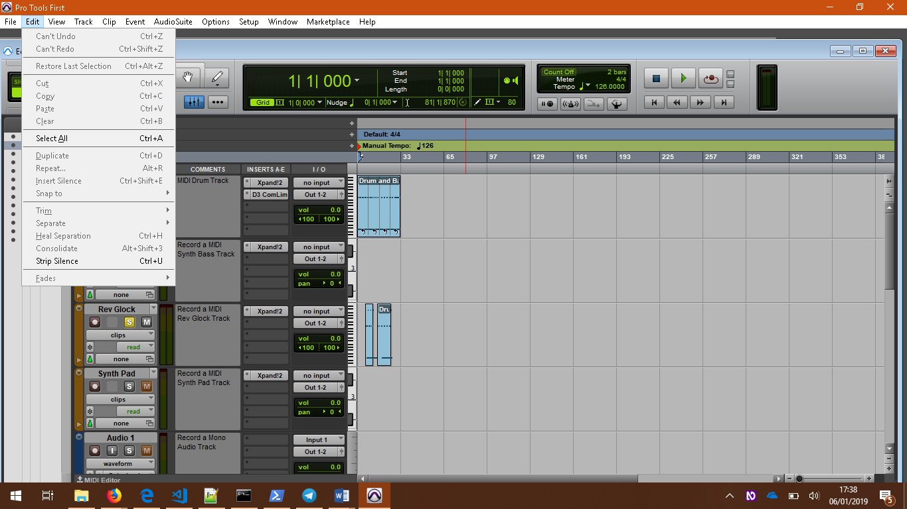
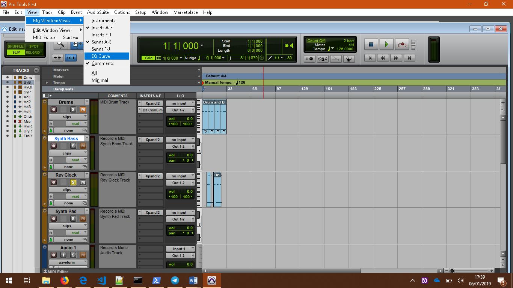
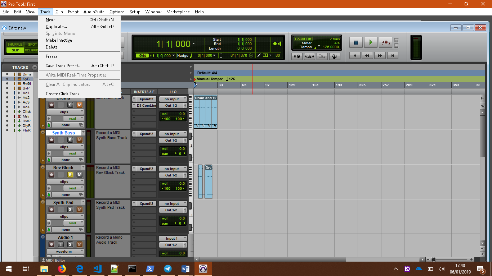
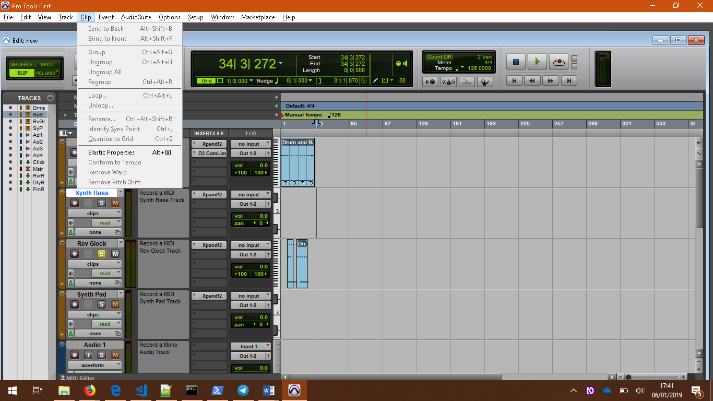
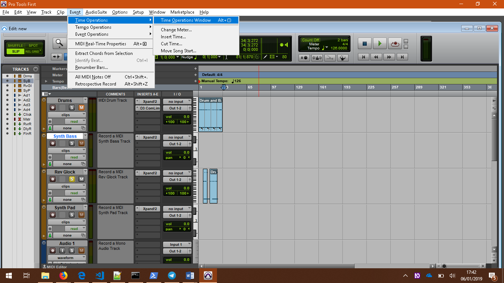
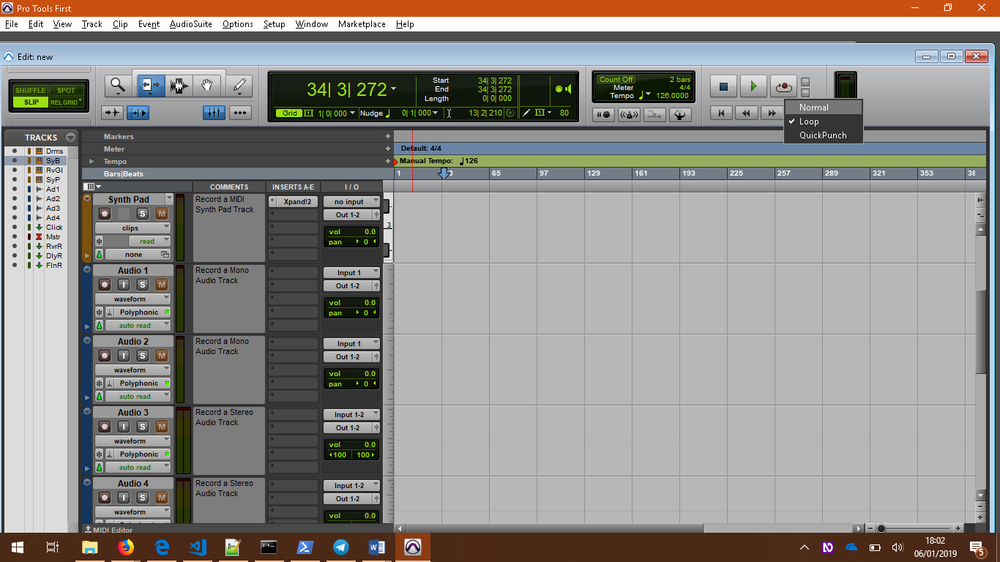
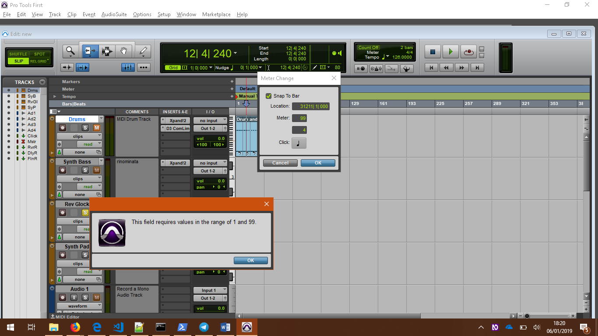
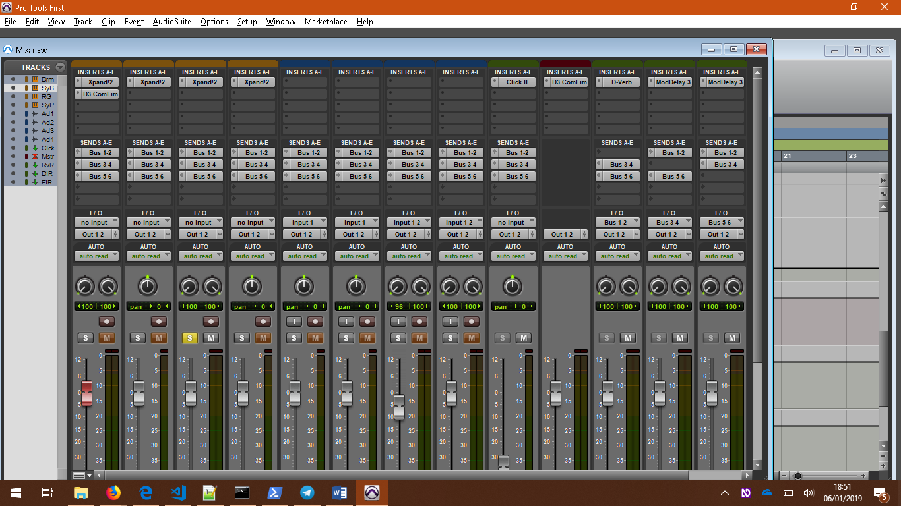

Pro tools Windows osservazioni
I commenti sono posti sopra le foto cui si riferiscono.
Non si ritiene necessario riportare gli screenshot relativi a tutti i controlli in quanto hanno gli stessi comportamenti, Per lo stesso motivo verranno omesse anche finestre o pannelli similari tra loro, citandone solo uno a titolo esemplificativo.
NVDA segnala solo la presenza di un campo editazione, mentre sposta dosi con F6 non avvengono cambiamenti e tentando con TAB pronuncia “dashboard”.
L’unico modo quindi per raggiungere il progetto è editare nel campo editazione il nome.
I controlli laterali “Open” e “Create” non vengono citati da NVDA, così come anche i pulsanti sottostanti “Create new session”, “Cancel”, “Open”.

Raggiungendo il menù “File” e selezionando “Open project” si è aperta il seguente pannello in cui gli elementi sono focalizzabili con le frecce solo nella parte destra coi controlli “Open” e “Create”, mentre la parte sinistra e i pulsanti “Create Session”, Cancel, “Open” sono del tutto irraggiungibili., Tale finestra non è utilizzabile autonomamente in quanto non viene pronunciato nulla dalla sintesi.
Anche questo pannello è stato testato usando i comandi di navigazione propri di Windows: tasto TAB, Control+Tab, F&,
Tentando innumerevoli combinazioni di tasti si è arrivati a scoprire la shortcut Control+Shift+O che ha permesso di emulare la funzione del tasto “Open” altrimenti irraggiungibile.

Il menù “File” contiene le seguenti opzioni:
* Create New... (Ctrl+N)
* Open Project... (Ctrl+O)
* Convert Session... (Ctrl+Alt+O)
* Open Recent 
* Close Project (Ctrl+Shift+W)
* Save (Ctrl+S)
* Revert to Saved...
* Import... (Ctrl+Shift+I)
* Export
* Exit (Ctrl+Q)

Il menù “Edit” contiene le seguenti funzionalità:
* Undo (Ctrl+Z)
* Redo (Ctrl+Shift+Z)
* Restore Last Selection (Ctrl+Alt+Z)
* Cut (Ctrl+X)
* Copy (Ctrl+C)
* Paste (Ctrl+V)
* Clear (Ctrl+B)
* Select All (Ctrl+A)
* Duplicate (Ctrl+D)
* Repeat... (Ctrl+R)
* Insert Silence (Ctrl+Shift+E)
* Snap to
* Trim
* Separate
* Heal Separation (Ctrl+H)
* Consolidate (Alt+Shift+3)
* Strip Silence (Ctrl+U)

Il menù “View” contiene i seguenti items:
* Mix Window Views
	* Instruments
	* Inserts A-E
	* Inserts F-J
	* Sends A-E
	* Sends F-J
	* EQ Curve
	* Comments 
	* All
	* Minimal
* Edit WIndow Views
* MIDI Edior (Start+=)

Il menù “Tracks” contiene le seguenti funzionalità:

* New... (Ctrl+Shift+N)
* Duplicate...  (Alt+Shift+D)
* Split into Mono 
* Make Inactive
* Delete
* Freeze
* Save Track Preset... (Alt+Shift+P)
* Write MIDI Real-Time Properties
* Clear All Clip Indicators (Alt+C)
* Create Click Track

Il menù “Clip” contiene i seguenti items:
* Send to Back (Alt+Shift+B)
* Bring to Front (Alt+Shift+F)
* Group (Ctrl+Alt+G)
* Ungroup (Ctrl+Alt+U)
* Ungroup All
* Regroup (Ctrl+Alt+L)
* Rename.... (Ctrl+Alt+Shift+R)
* Identity Sync Point (Ctrl+,)
* Quantize to Grid (Ctrl+0)
* Elastic PRoperties (Alt+5)
* Conform to Tempo
* Remove Warp
* Remove Pitch Shift

Nel Menù “Event” si trovano le seguenti opzioni:

* Time Operations
	* Time OPerations Window (Alt+1)
	* Change Meter...
	* Insert Time...
	* Cut Time...
	* Move Song Start...
* Tempo Operations
* Event Operations
* MIDI Real-Time Properties (Alt+4)
* Extract Chords from Selection
* Identity Beat...
* Renumber Bards...
* All MIDI Notes Off (Ctrl+Shift+.)
* Retrospective Record (Alt+Shift+Z)

Nel menù “Audio suite” si trovano le funzionalità seguenti:
* EQ
* Dynamics
* Pitch Shift 
* Reverb
* Delay
* Other
	* DC Offset Removal
	* Duplicate
	* Gain
	* Invert
	* Normalize
	* Reverse
	* Signal Generator
	* Time Compression Expansion

Nel menù “Options” si trovano gli items seguenti:
* Loop Record (Alt+L)
* QuickPunch (Ctrl+Shift+P)
* Pre/Post-Roll (Ctrl+K)
* Loop Playback (Ctrl+Shift+L)
* Edit Window Scrolling
* Insertion Follows PlaybackTab to Transient (Ctrl+Alt+Tab)
* Click
* Pre-Fader Metering
+ Low Latency Monitoring

* Il menù “Setup” contiene:
* Hardware...
* Playback Engine...
* MIDI Studio...
* MIDI Beat Clock...
* MIDI Input Filter...
* MIDI Input Devices...
* Click/Countoff....
* Language

Il menù “Window” contiene le seguenti funzioni:
* Arrange
* Hide All Floating Windows (Ctrl+Alt+Start+W)
* Close Windo (Ctrl+W)
* Mix (Ctrl+=)
* Task Manager (Alt+')
* Soundbase (Alt+Start+I)
* Transport (Ctrl+1)
* Big Counter (Ctrl+3)
* Memory Locations (Ctrl+5)
* Color Palette
* Metadata Inspector
* Undo History
* Artist Chat Ctrl+Shift+=
* System Usage

Il seguente raggruppamento di controlli è stato testato usando il tracking del mouse. In questa sezione i controlli non vengono individuati; però i relativi menù contestuali vengono letti correttamente. 

Il seguente raggruppamento di controlli è stato testato usando il tracking del mouse. In questa sezione i controlli non vengono individuati; però i relativi menù contestuali vengono letti correttamente. 

Usando il tasto TAB si è raggiunta la sezione per rinominare. È sufficiente entrare nel campo editazione e digitare il testo, per confermare premere Invio. Non è quindi non è richiesta la pressione del tasto F2.

Il menù contestuale relativo alla traccia consente di adoprare le seguenti funzioni, come si vede nello screenshot, ma si è deciso di soffermarsi sulla funzione “meter change”. Essa è raggiungibile selezionando la voce “Insert” e successivamente, dal suo sottomenù, “Meter”.

La funzionalità “Change meter” non è accessibile: i field sono focalizzabili ma non viene dato un feedback vocale quando ci si sposta tra l’uno e l’altro col tasto TAB e è anche impossibile raggiungere i pulsanti sottostanti.

In questo contesto l’’unica finestra leggibile è quella d’errore, letta correttamente, eccetto il fatto che non viene segnalata dalla sintesi la presenza del tasto di conferma.

“Strip silence” raggiungibile con “Control+Shift+U”la sintesi legge “barra del titolo strip silence”. Si può intuire che anche con le altre finestre  avrà lo stesso comporrtamento.

<!-- CHIEDERE A BONTEMPI A COSA SERVE STRIP SILENCE -->

Questo pannello è stato aperto usando il mouse. Di questo pop-down la sintesi vocalizza “Transport MIDI editor location” ; “MIDI editor quantize real time properties”; “Add new memory location”; “playback engine”; “artist community” “Market place”  etc… Tag che non hanno senso se isolati dal contesto, ossia se la sintesi non elenca  quali possibilità di interazione esistono con questi controlli.

L’aprire questo menù è cosa infattibile da tastiera, ancora una volta si deve ricorrere all’uso del mouse. Gli items di questo menù vengono correttamente annunciati, e permette di eseguire alcune funzioni sulle tracce ad esempio rinominare, salvare la traccia come preset, come si può vedere dallo screenshot. 

Per avviare la registrazione è necessario premere la combinazione di tasti Control+RE, ma non si ha alcun feedback sonoro dell’avvenuta operazione. Il feedback fornito è esclusivamente visivo.
Il mixer è raggiungibile dal menù “Window”, selezionando la voce “Mix”, ma una volta aperto è impossibile eseguire qualsiasi operazione: dal punto did vista della sintesi lo schermo appare come se fosse privo di eelementi. Se si tenta la strada di cliccare i controlli col mouse, i menù contestuali relativi vengono letti dalla sintesi, ma la cosa risulta al quanto frustrante e rende necessario l’ausilio di un controller esterno. Eco perché si è scelto di testare anche con device esterno E Corg

